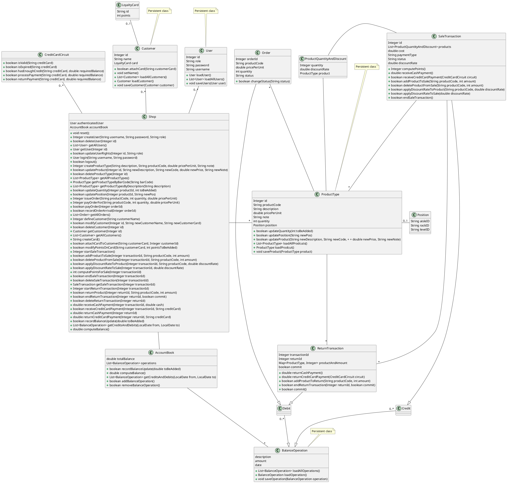

# Design Document 

- [Design Document](#design-document)
- [Instructions](#instructions)
- [High Level Design](#high-level-design)
- [Low Level Design](#low-level-design)
- [Verification Traceability Matrix](#verification-traceability-matrix)
- [Verification sequence diagrams](#verification-sequence-diagrams)
    - [Add new product](#add-new-product)
    - [Issue and Pay Order](#issue-and-pay-order)
    - [Define Costumer and Card](#define-costumer-and-card)
    - [Modify Customer](#modify-customer)
    - [Manage Sale with Credit Card](#manage-sale-with-credit-card)
    - [Manage Return with Credit Card](#manage-return-with-credit-card)
    - [Accounting](#accounting)


Authors: 

* S281564 Marco Manco
* S290136 Giovanni Pollo
* S292477 Matteo Quarta
* S29260  Davide Fersino
  
Date: 30/04/2021

Version: 1.0

# Instructions

The design must satisfy the Official Requirements document, notably functional and non functional requirements

# High Level Design 

We chose the 3-Tier Architectural Pattern


```plantuml

[GUI] as GUI

[Model and Logic Application] as MLA

[Data Storage] as DS


GUI --> MLA
MLA --> DS

note "Contains API, \nExceptions and Classes" as N2
N2 ..left.. MLA 
```


# Low Level Design



# Verification Traceability Matrix

|                           |  FR1  |  FR2  |  FR3  |  FR4  |  FR5  |  FR6  |  FR7  |
| ------------------------- | :---: | :---: | :---: | :---: | :---: | :---: | :---: |
| Account Book              |       |       | **X** |       |       | **X** | **X** |
| BalanceOperation          |       |       | **X** |       |       | **X** | **X** |
| Return Transaction        |       |       |       |       | **X** | **X** |       |
| Credit                    |       |       |       |       |       | **X** |       |
| CreditCardCircuit         |       |       |       |       |       | **X** |       |
| Debit                     |       |       | **X** |       |       | **X** |       |
| Customer                  |       |       |       | **X** | **X** |       |       |
| LoyaltyCard               |       |       |       | **X** | **X** |       |       |
| Order                     |       |       | **X** |       |       |       |       |
| Position                  |       | **X** | **X** |       |       |       |       |
| ProdctQuantityAndDiscount |       | **X** | **X** |       | **X** |       |       |
| ProductType               |       | **X** | **X** |       | **X** |       |       |
| Sale Transaction          |       |       |       |       | **X** | **X** |       |
| Shop                      | **X** | **X** | **X** | **X** | **X** | **X** | **X** |
| User                      | **X** | **X** | **X** | **X** | **X** | **X** | **X** |


# Verification sequence diagrams 

### Add new product
```plantuml
Shop -> Shop : login()
Shop -> Shop : createProductType()
Shop -> ProductType : updatePosition()
ProductType -> ProductType : updatePosition()
```
### Issue and Pay Order
```plantuml
Shop -> Shop : login()
Shop -> Shop : issueOrder()
Shop -> Shop : getOrder()
Shop -> Order : payOrder()
Order -> Order: changeStatus()
Shop -> AccountBook : recordBalanceUpdate()
AccountBook -> AccountBook : recordBalanceUpdate()
```
### Define Costumer and Card
```plantuml
Shop -> Shop : login()
Shop -> Shop : defineCustomer()
Shop -> Shop : createCard()
Shop -> Shop : getCustomer()
Shop -> Customer : attachCardToCustomer()
Customer -> Customer : attachCard()
```
### Modify Customer
```plantuml
Shop -> Shop : login()
Shop -> Shop : getCustomer()
Shop -> Customer : modifyCustomer()
Customer -> Customer : setName()
Customer -> Customer : attachCard()
```
### Manage Sale with Credit Card
```plantuml
Shop -> Shop : login()
Shop -> Shop : startSaleTransaction()
Shop -> SaleTransaction: addProductToSale()
SaleTransaction -> SaleTransaction: addProduct()
SaleTransaction -> ProductType : updateQuantity()
ProductType -> ProductType : updateQuantity()
Shop -> SaleTransaction : endSaleTransaction()
SaleTransaction -> SaleTransaction : endSaleTransaction()
SaleTransaction--> Shop : status
Shop -> SaleTransaction : receiveCreditCardPayment()
SaleTransaction -> CreditCardCircuit : isValid()
CreditCardCircuit --> SaleTransaction : valid
SaleTransaction -> CreditCardCircuit : hasEnoughCash()
CreditCardCircuit --> SaleTransaction : enough
SaleTransaction -> CreditCardCircuit : processPayment()
CreditCardCircuit --> Shop: processed
Shop -> AccountBook : recordBalanceUpdate()
AccountBook -> AccountBook : recordBalanceUpdate()
```
### Manage Return with Credit Card
```plantuml
Shop -> Shop : login()
Shop -> Shop : startReturnTransaction()
Shop -> ReturnTransaction : returnProduct()
ReturnTransaction -> ProductType : updateQuantity()
ProductType -> ProductType : updateQuantity()
Shop -> ReturnTransaction : endReturnTransaction()
ReturnTransaction -> ReturnTransaction : commit()
ReturnTransaction --> Shop : commit
Shop -> ReturnTransaction : returnCreditCardPayment()
ReturnTransaction -> CreditCardCircuit : isValid()
CreditCardCircuit --> ReturnTransaction : valid
ReturnTransaction -> CreditCardCircuit : returnPayment()
CreditCardCircuit --> Shop: returned
Shop -> AccountBook : recordBalanceUpdate()
AccountBook -> AccountBook : recordBalanceUpdate()
```
### Accounting
```plantuml
Shop -> Shop : login()
Shop -> AccountingBook : getCreditsAndDebits()
AccountingBook -> AccountingBook : getCreditsAndDebits()
AccountingBook --> Shop : credits and debits
```


