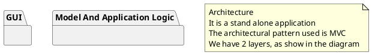

# Design Document 

Authors: 
* S292477 Matteo Quarta
* S281564 Manco Marco
* S290136 Davide Fersino
* S29260 Giovanni Pollo
  
Date: 30/04/2021

Version: 1.0

# Contents

- [Design Document](#design-document)
- [Contents](#contents)
- [Instructions](#instructions)
- [High level design](#high-level-design)
- [Low level design](#low-level-design)
- [Verification Traceability Matrix](#verification-traceability-matrix)
- [Verification sequence diagrams](#verification-sequence-diagrams)

# Instructions

The design must satisfy the Official Requirements document, notably functional and non functional requirements

# High level design 

We choose the MVC pattern
<report package diagram>

# Low level design

# Verification Traceability Matrix

for each functional requirement from the requirement document, list which classes concur to implement it

|                           |  FR1  |  FR2  |  FR3  |  FR4  |  FR5  |  FR6  |  FR7  |
| ------------------------- | :---: | :---: | :---: | :---: | :---: | :---: | :---: |
| Account Book              |       |       | **X** |       |       | **X** | **X** |
| BalanceOperation          |       |       | **X** |       |       | **X** | **X** |
| Return Transaction        |       |       |       |       | **X** | **X** |       |
| Credit                    |       |       |       |       |       | **X** |       |
| CreditCardCircuit         |       |       |       |       |       | **X** |       |
| Debit                     |       |       | **X** |       |       | **X** |       |
| Customer                  |       |       |       | **X** | **X** |       |       |
| LoyaltyCard               |       |       |       | **X** | **X** |       |       |
| Order                     |       |       | **X** |       |       |       |       |
| Position                  |       | **X** | **X** |       |       |       |       |
| ProdctQuantityAndDiscount |       | **X** | **X** |       | **X** |       |       |
| ProductType               |       | **X** | **X** |       | **X** |       |       |
| Sale Transaction          |       |       |       |       | **X** | **X** |       |
| Shop                      | **X** | **X** | **X** | **X** | **X** | **X** | **X** |
| User                      | **X** | **X** | **X** | **X** | **X** | **X** | **X** |

# Verification sequence diagrams 
\<select key scenarios from the requirement document. For each of them define a sequence diagram showing that the scenario can be implemented by the classes and methods in the design>

