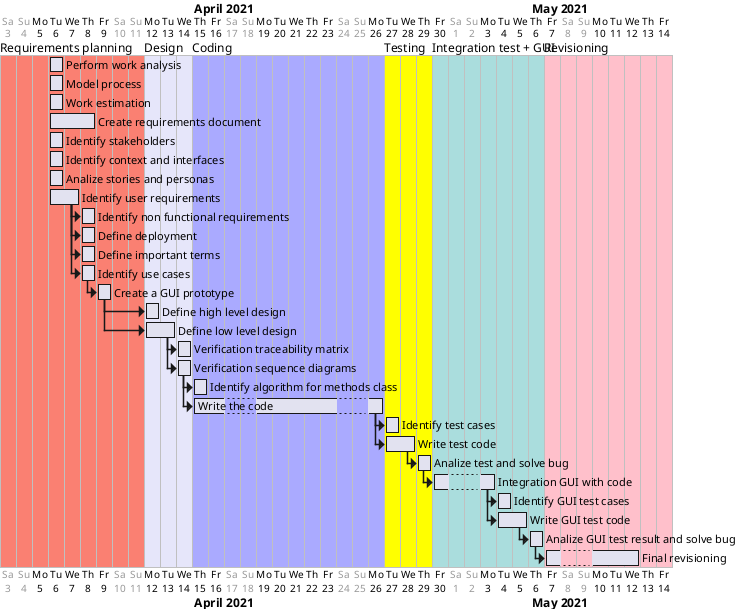

# Project Estimation 
- [Project Estimation](#project-estimation)
- [Estimate by Product Decomposition](#estimate-by-product-decomposition)
- [Estimate by activity decomposition](#estimate-by-activity-decomposition)
- [Gantt Diagram](#gantt-diagram)

Authors: 
* S281564 Marco Manco
* S290136 Giovanni Pollo
* S292477 Matteo Quarta
* S292602 Davide Fersino
  
Date: 30/04/2021

Version: 1.0

# Estimate by Product Decomposition

|                         | Estimate |    Unit     |
| :---------------------- | :------: | :---------: |
| Number of Classes       |    15    |  #Classes   |
| Avereage Class Size     |   450    |     LOC     |
| Esitimated Project Size |   6800   |     LOC     |
| Estimated Effort        |   680    | PersonHours |
| Estimated Cost          |  20'500  |      €      |
| Estimated Time          |   4-5    |    Weeks    |

# Estimate by activity decomposition
| Activity name                            | Estimated effort (person hours) |
| ---------------------------------------- | ------------------------------- |
| 1 Requirements planning                  |                                 |
| 1.1 Perform work analysis                | 6                               |
| 1.2 Model process                        | 3                               |
| 1.3 Work estimation                      | 4                               |
| 1.4 Identify stakeholders                | 4                               |
| 1.5 Identify context and interfaces      | 4                               |
| 1.6 Analize stories and personas         | 2                               |
| 1.7 Identify user requirements           | 10                              |
| 1.8 Identify non functional requirements | 3                               |
| 1.9 Identify use cases                   | 7                               |
| 1.10 Define important terms              | 6                               |
| 1.11 Define deployment                   | 2                               |
| 1.12 Create requirements document        | 50                              |
| 1.13 Create a GUI prototype              | 30                              |
| 2 Design                                 |                                 |
| 2.1 Define high level design             | 4                               |
| 2.2 Define low level design              | 40                              |
| 2.3 Verification traceability matrix     | 3                               |
| 2.4 Verification sequence diagrams       | 5                               |
| 3 Coding                                 |                                 |
| 3.1 Identify algorithm for methods class | 10                              |
| 3.2 Write the code                       | 250                             |
| 4 Testing                                |                                 |
| 4.1 Identify test cases                  | 10                              |
| 4.1 Write test code                      | 50                              |
| 4.2 Analize test result                  | 10                              |
| 5 Integration test and GUI               |                                 |
| 5.1 Integration GUI with code            | 50                              |
| 5.2 Identify GUI test cases              | 10                              |
| 5.3 Write GUI test code                  | 50                              |
| 5.4 Analize GUI test result              | 10                              |
| 6 Revisioning                            |                                 |
| 6.1 Final revisioning                    | 100                             |

# Gantt Diagram

