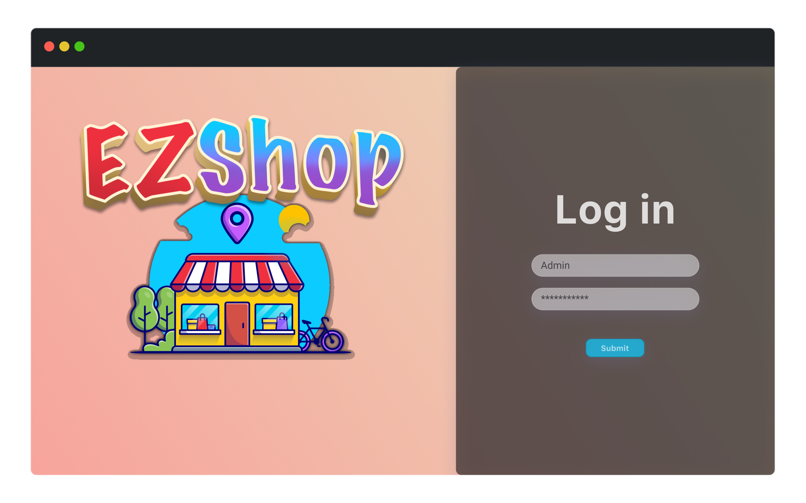
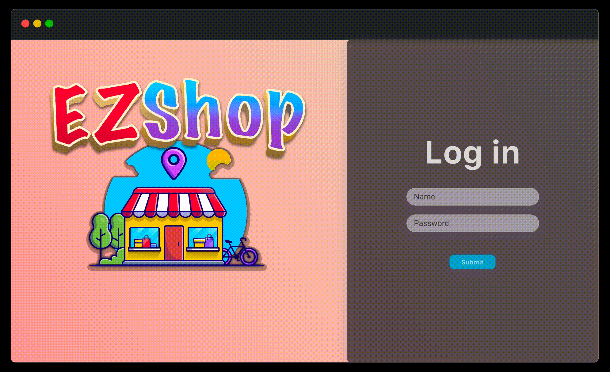
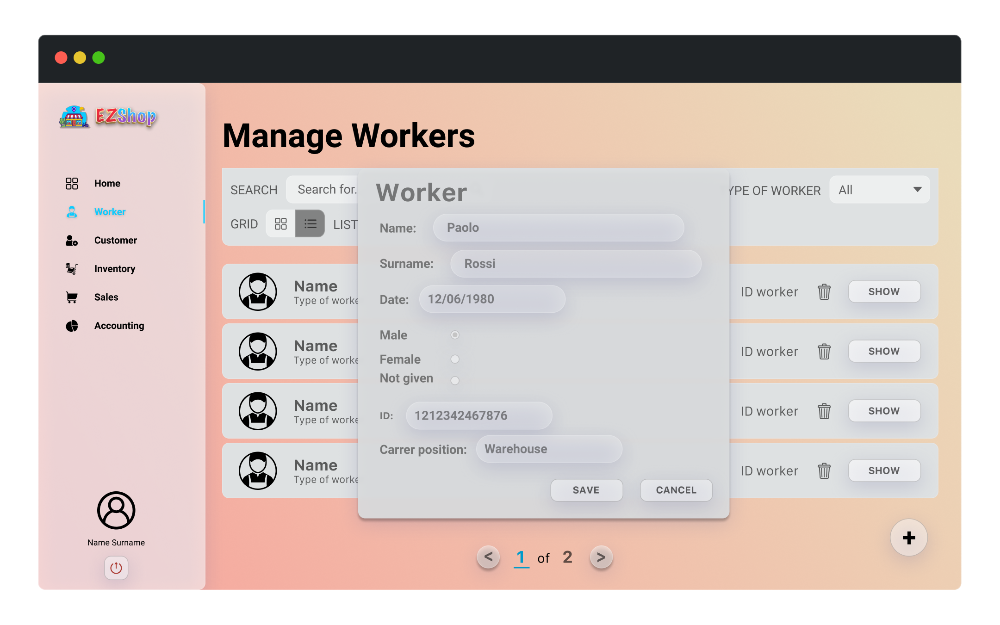
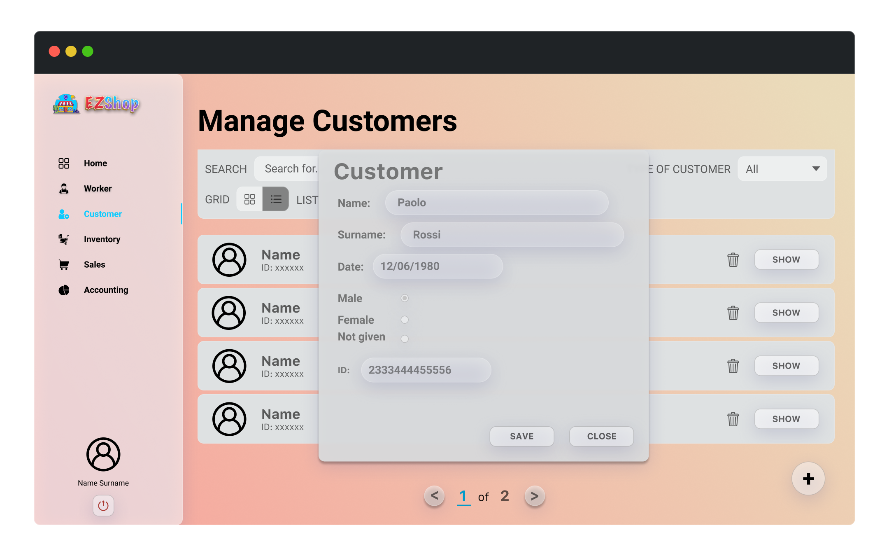
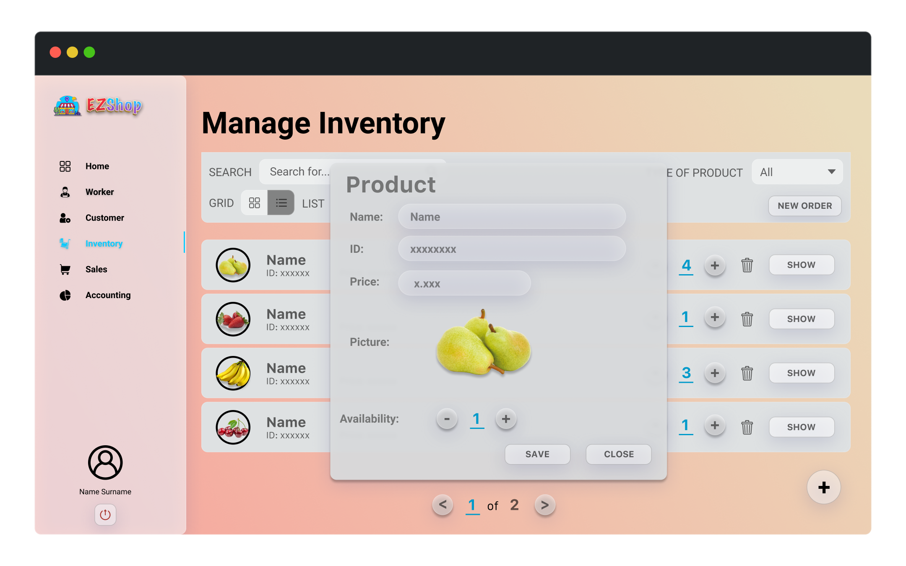
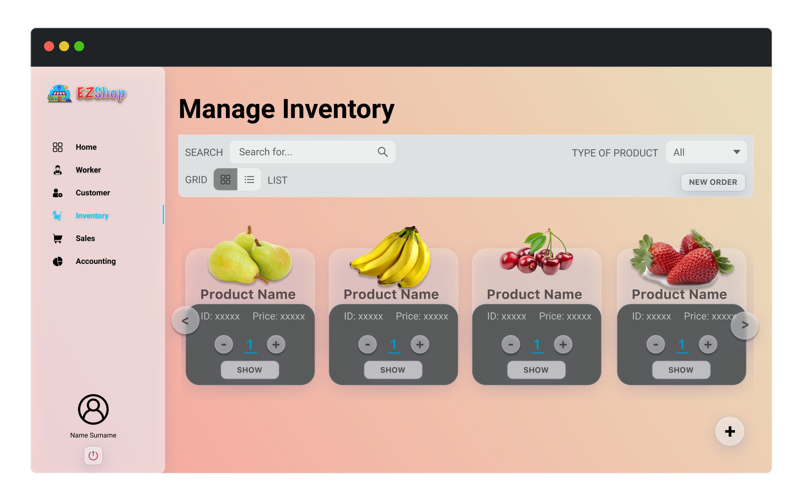
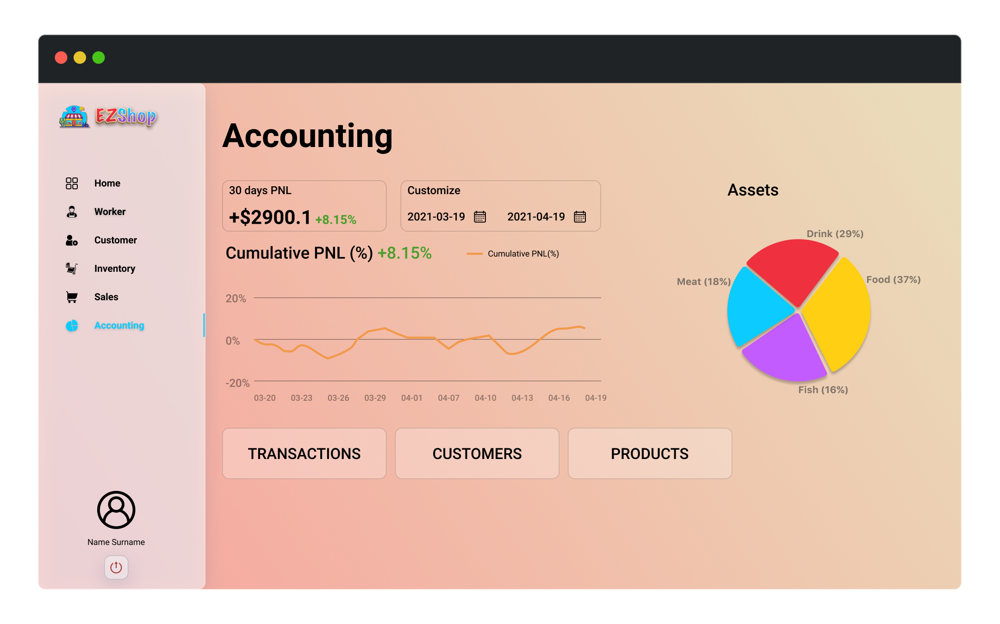
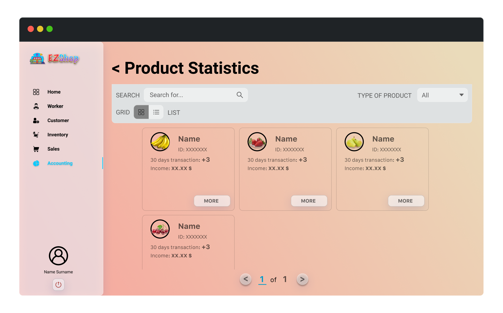
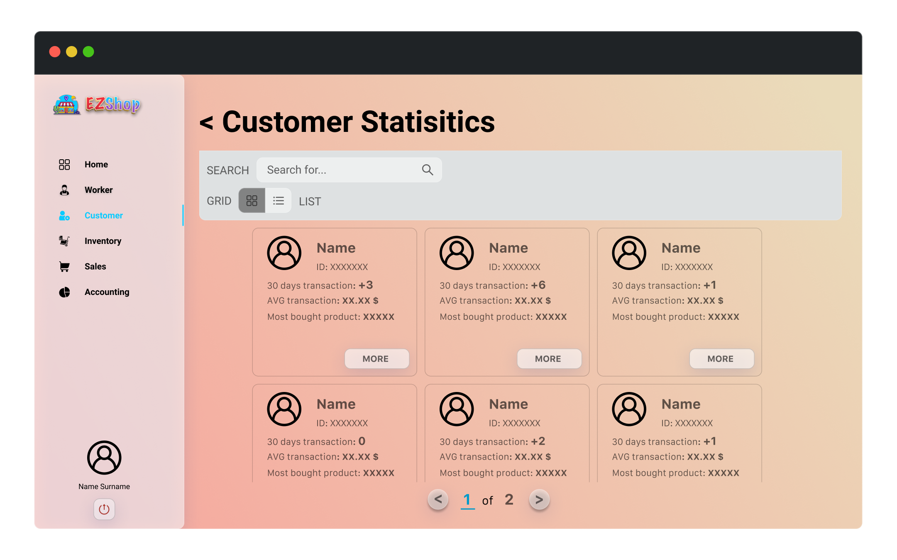
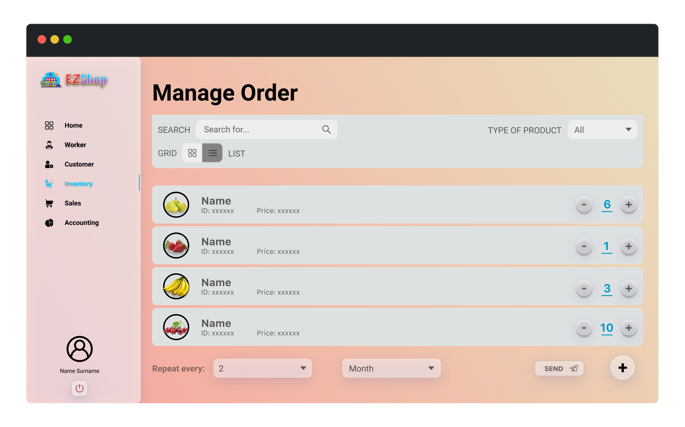

# Graphical User Interface Prototype  

Authors:

Date:

Version:

### Use case 1, UC1

### Use case 3, UC3

#### Scenario 3.2 

### Use case 4, UC4

### Use case 5, UC5

### Use case 7, UC7

### Use case 8, UC8

### Use case 10, UC10

### Use case 11, UC11

### Use Case 13, UC13

### Use Case 14, UC14

### Use Case 15, UC15

### Use Case 16, UC16 and Use Case 17, UC17

