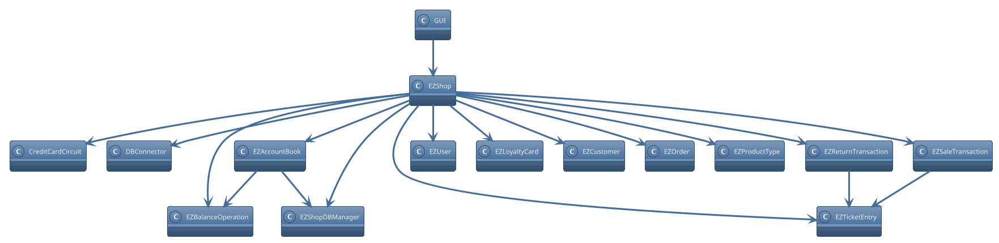

# Integration and API Test Documentation

Authors:
* S281564 Marco Manco
* S290136 Giovanni Pollo
* S292477 Matteo Quarta
* S292602  Davide Fersino

Date:

Version: 1.0

# Contents

- [Dependency graph](#dependency-graph)

- [Integration and API Test Documentation](#integration-and-api-test-documentation)
- [Contents](#contents)
- [Dependency graph](#dependency-graph)
- [Integration approach](#integration-approach)
- [Tests](#tests)
  - [Step 1](#step-1)
  - [Step 2](#step-2)
  - [Step 3](#step-3)
- [Coverage of Scenarios and FR](#coverage-of-scenarios-and-fr)
- [Coverage of Non Functional Requirements](#coverage-of-non-functional-requirements)

  - 

- [Tests](#tests)

- [Scenarios](#scenarios)

- [Coverage of scenarios and FR](#scenario-coverage)
- [Coverage of non-functional requirements](#nfr-coverage)

# Dependency graph

# Integration approach

For our tests we have chosen a bottom up approach.

Step 1: Unit testing

Step 2: Intermediate testing

Step : API testing

# Tests

<define below a table for each integration step. For each integration step report the group of classes under test, and the names of
JUnit test cases applied to them> JUnit test classes should be here src/test/java/it/polito/ezshop

## Step 1

| Classes | JUnit test cases |
| ------- | ---------------- |
| EZTicketEntry.java | TestEZTicketEntry.testSetBarCode() TestEZTicketEntry.testSetProductDescription() TestEZTicketEntry.testSetAmount() TestEZTicketEntry.testSetPricePerUnit() TestEZTicketEntry.testSetDiscountRate() |
| EZOrder.java | TestEZOrder.testSetBalanceId() TestEZOrder.testSetProductCode() TestEZOrder.testSetPricePerUnit() TestEZOrder.testSetQuantity() TestEZOrder.testSetStatus() TestEZOrder.testSetOrderID() |
| EZBalanceOperation.java | TestEZBalanceOperation.testSetBalanceId() TestEZBalanceOperation.testSetDate() TestEZBalanceOperation.testSetMoney() TestEZBalanceOperation.testSetType() |
| EZUser.java | TestEZUser.setId() TestEZUser.setUsername() TestEZUser.setPassword() TestEZUser.setRole() |
| EZProductType.java | TestEZProductType.setQuantity() TestEZProductType.setLocation() TestEZProductType.setNote() TestEZProductType.setProductDescription() TestEZProductType.setBarCode() TestEZProductType.setPricePerUnit() TestEZProductType.setId() |
| EZCustomer.java | TestEZCustomer.testXSetter() TestEZCustomer.testCustomerCardSetter() TestEZCustomer.testCustomerNameSetter() TestEZCustomer.testSetId() TestEZCustomer.testSetPoints() |
| CreditCardCircuit.java | TestCreditCardCircuit.testCardPresentInFile() TestCreditCardCircuit.testCardNotPresentInFile() TestCreditCardCircuit.testNegativeMinBalance() TestCreditCardCircuit.testCardNotPresentDuringHasEnoughBalance() TestCreditCardCircuit.testCardBalanceInsufficientDuringHasEnoughBalance() TestCreditCardCircuit.testCardBalanceSufficientDuringHasEnoughBalance() TestCreditCardCircuit.testNegativePayAmount() TestCreditCardCircuit.testCardNotPresentDuringPay() TestCreditCardCircuit.testCardBalanceInsufficientDuringPay() TestCreditCardCircuit.testCardBalanceSufficientDuringPay() TestCreditCardCircuit.testNegativeRefundAmount() TestCreditCardCircuit.testCardNotPresentDuringRefund() TestCreditCardCircuit.testRefundSuccess() |

## Step 2

| Classes | JUnit test cases |
| ------- | ---------------- |
| EZAccountBook.java | TestEZAccountBook.testSingleton() TestEZAccountBook.testGetBOList() TestEZAccountBook.testComputeBalanceAllPositive() TestEZAccountBook.testComputeBalanceAllNegative() TestEZAccountBook.testComputeBalanceMixed1() TestEZAccountBook.testComputeBalanceMixed2() TestEZAccountBook.testComputeBalanceMixed3() |
| EZReturnTransaction.java | TestEZReturnTransaction.testSetReturnId() TestEZReturnTransaction.testSetTransactionId() TestEZReturnTransaction.testSetProducts() TestEZReturnTransaction.testSetCommit TestEZReturnTransaction.testSetStatus TestEZReturnTransaction.testSetDiscountRate() TestEZReturnTransaction.testAddProductReturnedAndGetPrice() TestEZReturnTransaction.testAddProductReturnedAndGetPriceWithDiscount() |
| EZSaleTransaction.java | TestEZSaleTransaction.setUp() TestEZSaleTransaction.tearDown() TestEZSaleTransaction.testSetProducts() TestEZSaleTransaction.testSetEntries() TestEZSaleTransaction.testSetPaymentType() TestEZSaleTransaction.testSetStatus() TestEZSaleTransaction.testSetTicketNumber() TestEZSaleTransaction.testSetDiscountRate() TestEZSaleTransaction.testSetPrice() TestEZSaleTransaction.testSetPriceWithProduct() TestEZSaleTransaction.testComputePointsWithPrice() TestEZSaleTransaction.testComputePointsWithProduct() TestEZSaleTransaction.testReceiveCashPaymentValid() TestEZSaleTransaction.testReceiveCashPaymentInvalid() TestEZSaleTransaction.testReceiveCreditCardPayment() TestEZSaleTransaction.testGetEntry() TestEZSaleTransaction.testDeleteProductFromSaleValid() TestEZSaleTransaction.testDeleteProductFromSaleInvalid() TestEZSaleTransaction.testApplyDiscountRateToProduct() TestEZSaleTransaction.testEndSaleTransaction() TestEZSaleTransaction.testValidLuhnAlgorithm() |
| EZTicketEntry.java | TestEZTicketEntry.testSetBarCode() TestEZTicketEntry.testSetProductDescription() TestEZTicketEntry.testSetAmount() TestEZTicketEntry.testSetPricePerUnit() TestEZTicketEntry.testSetDiscountRate() |
| EZShopDBManager.java | TestEZShopDBManager.testGetNextUserID() TestEZShopDBManager.testLoadAllUsers() TestEZShopDBManager.testLoadUserFromID() TestEZShopDBManager.testLoadUserFromUsernameAndPass() TestEZShopDBManager.testUserExistsFromID() TestEZShopDBManager.testUserExistsFromUsername() TestEZShopDBManager.testUpdateUserRights() TestEZShopDBManager.testDeleteUser() TestEZShopDBManager.testGetNextCustomerID() TestEZShopDBManager.testLoadAllCustomers() TestEZShopDBManager.testLoadCustomerFromID() TestEZShopDBManager.testLoadCustomerFromCard() TestEZShopDBManager.testCustomerExistsFromID() TestEZShopDBManager.testCustomerExistsFromName() TestEZShopDBManager.testCustomerExistsFromCard() TestEZShopDBManager.testUpdateCustomer() TestEZShopDBManager.testDeleteCustomer() TestEZShopDBManager.testGetNextOrderID() TestEZShopDBManager.testLoadAllOrders() TestEZShopDBManager.testLoadOrderFromID() TestEZShopDBManager.testUpdateOrder() TestEZShopDBManager.testGetNextProductID() TestEZShopDBManager.testLoadAllProducts() TestEZShopDBManager.testLoadProductFromID() TestEZShopDBManager.testLoadProductFromBarCode() TestEZShopDBManager.testProductExistsFromID() TestEZShopDBManager.testProductExistsFromBarCode() TestEZShopDBManager.testProductExistsFromLocation() TestEZShopDBManager.testUpdateProduct() TestEZShopDBManager.testDeleteProduct() TestEZShopDBManager.testGetNextSaleID() TestEZShopDBManager.testLoadAllSales() TestEZShopDBManager.testLoadSaleFromID() TestEZShopDBManager.testUpdateSale() TestEZShopDBManager.testDeleteSale() TestEZShopDBManager.testGetNextBalanceOperationID() TestEZShopDBManager.testLoadAllBalanceOperations() TestEZShopDBManager.testGetNextReturnID() TestEZShopDBManager.testLoadReturnFromID() TestEZShopDBManager.testUpdateReturnStatus() TestEZShopDBManager.testDeleteReturn() |

## Step 3

| Classes | JUnit test cases |
| ------- | ---------------- |
| EZShop.java | TestEZShop.testCreateUser()  TestEZShop.testDeleteUser() TestEZShop.testGetAllUsers() TestEZShop.testGetUser() TestEZShop.testUpdateUserRights() TestEZShop.testLogin() TestEZShop.testLogout() TestEZShop.createProductType() TestEZShop.updateProduct() TestEZShop.deleteProductType() TestEZShop.getAllProductTypes() TestEZShop.getProductTypeByBarCode() TestEZShop.getProductTypesByDescription() TestEZShop.updateQuantity() TestEZShop.updatePosition() TestEZShop.defineCustomer() TestEZShop.modifyCustomer() TestEZShop.deleteCustomer() TestEZShop.getCustomer() TestEZShop.getAllCustomers() TestEZShop.createCard() TestEZShop.attachCardToCustomer() TestEZShop.modifyPointsOnCard() TestEZShop.testStartSaleTransaction() TestEZShop.testAddProductToSale() TestEZShop.testDeleteProductFromSale() TestEZShop.testApplyDiscountRateToProduct() TestEZShop.testapplyDiscountRateToSale() TestEZShop.testComputePointsForSale() TestEZShop.testEndSaleTransaction() TestEZShop.testDeleteSaleTransaction() TestEZShop.testGetSaleTransactio() TestEZShop.testStartReturnTransaction() TestEZShop.testReturnProduct() TestEZShop.testEndReturnTransaction() TestEZShop.testDeleteReturnTransaction() TestEZShop.testReceiveCashPayment() TestEZShop.testReceiveCreditCardPayment() TestEZShop.testReturnCashPayment() TestEZShop.testReturnCreditCardPayment() TestEZShop.testIssueOrder() TestEZShop.testPayOrderFor() TestEZShop.testPayOrder() TestEZShop.testRecordOrderArrival() TestEZShop.testRecordBUAndCB() TestEZShop.testGetDebitsCreditsAndCB() TestEZShop.testValidBarCode() |

# Coverage of Scenarios and FR

| Scenario ID | FR covered | JUnit Test(s)                  |
| :---------: | :--------: | :----------------------------- |
|     1-*     |    FR3     | TestEZShop.testDeleteProductType()          |
|             |            | TestEZShop.testGetAllProductTypes()         |
|     1-1     |    FR3     | TestEZShop.testCreateProductType()          |
|             |            | TestEZShop.testValdiBarCode()               |
|     1-2     |    FR3     | TestEZShop.testUpdatePosition()             |
|             |            | TestEZShop.testUpdateProduct()              |
|     1-3     |    FR3     | TestEZShop.testUpdateProduct()              |
|     2-*     |    FR1     | TestEZShop.testGetAllUsers()                |
|     2-1     |    FR1     | TestEZShop.testCreateUser()                 |
|     2-2     |    FR1     | TestEZShop.testDeleteUsers()                |
|     2-3     |    FR1     | TestEZShop.testGetUser()                    |
|     2-3     |            | TestEZShop.testUpdateUserRights()           |
|     3-*     |    FR4     | TestEZShop.testGetAllOrders()               |
|     3-1     |    FR4     | TestEZShop.testIssueOrder()                 |
|     3-2     |    FR4     | TestEZShop.testPayOrder()                   |
|     3-2     |    FR4     | TestEZShop.testPayOrderFor()                |
|     3-3     |    FR4     | TestEZShop.testRecordOrderArrival()         |
|     4-*     |    FR5     | TestEZShop.testGetCustomer()                |
|             |            | TestEZShop.testGetAllCustomers()            |
|             |            | TestEZShop.testDeleteCustomers()            |
|     4-1     |    FR5     | TestEZShop.testDefineCustomer()             |
|     4-2     |    FR5     | TestEZShop.testAttachCardToCustomer()       |
|             |            | TestEZShop.testCreateCard()                 |
|     4-3     |    FR5     | TestEZShop.testAttachCardToCustomer()       |
|     4-4     |    FR5     | TestEZShop.testModifyCustomer()             |
|             |    FR5     | TestEZShop.testModifyPointsOnCard()         |
|     5-1     |    FR1     | TestEZShop.testLogin()                      |
|     5-2     |    FR1     | TestEZShop.testLogout()                     |
|     6-*     |    FR6     | TestEZShop.testGetSaleTransaction()         |
|     6-1     |    FR6     | TestEZShop.testStartSaleTransaction()       |
|             |            | TestEZShop.testAddProductToSale()           |
|             |            | TestEZShop.testDeleteProductFromSale()      |
|             |            | TestEZShop.testRecieveCashPayment()         |
|             |            | TestEZShop.testEndSaleTransaction()         |
|     6-2     |    FR6     | TestEZShop.testStartSaleTransaction()       |
|             |            | TestEZShop.testAddProductToSale()           |
|             |            | TestEZShop.testDeleteProductFromSale()      |
|             |            | TestEZShop.testApplyDiscountRateToProduct() |
|             |            | TestEZShop.testRecieveCashPayment()         |
|             |            | TestEZShop.testEndSaleTransaction()         |
|     6-3     |    FR6     | TestEZShop.testStartSaleTransaction()       |
|             |            | TestEZShop.testAddProductToSale()           |
|             |            | TestEZShop.testDeleteProductFromSale()      |
|             |            | TestEZShop.testApplyDiscountRateToSale()    |
|             |            | TestEZShop.testRecieveCashPayment()         |
|             |            | TestEZShop.testEndSaleTransaction()         |
|     6-4     |    FR6     | TestEZShop.testStartSaleTransaction()       |
|             |            | TestEZShop.testAddProductToSale()           |
|             |            | TestEZShop.testDeleteProductFromSale()      |
|             |            | TestEZShop.testApplyDiscountRateToSale()    |
|             |            | TestEZShop.testComputePointsForSale()       |
|             |            | TestEZShop.testRecieveCashPayment()         |
|             |            | TestEZShop.testEndSaleTransaction()         |
|     6-4     |    FR6     | TestEZShop.testStartSaleTransaction()       |
|             |            | TestEZShop.testEndSaleTransaction()         |
|     6-5     |    FR6     | TestEZShop.testEndSaleTransaction()         |
|             |            | TestEZShop.testRecieveCashPayment()         |
|     7-1     |    FR7     | TestEZShop.testRecieveCreditCardPayment()   |
|     7-2     |    FR7     | TestEZShop.testRecieveCreditCardPayment()   |
|     7-3     |    FR7     | TestEZShop.testRecieveCreditCardPayment()   |
|     7-4     |    FR7     | TestEZShop.testRecieveCashPayment()         |
|     8-*     |    FR7     | TestEZShop.testDeleteReturnTransaction()    |
|     8-1     |    FR7     | TestEZShop.testStartReturnTransaction()     |
|             |            | TestEZShop.testReturnProduct()              |
|             |            | TestEZShop.testEndReturnTransaction()       |
|             |            | TestEZShop.testReturnCreditCardPayment()    |
|     8-2     |    FR7     | TestEZShop.testStartReturnTransaction()     |
|             |            | TestEZShop.testReturnProduct()              |
|             |            | TestEZShop.testEndReturnTransaction()       |
|             |            | TestEZShop.testRetrunCashPayment()          |
|     9-1     |    FR8     | TestEZShop.testGetDebitdsAndCreditsAndCB()  |
|             |            | TestEZShop.testGetBODates()                 |
|    10-1     |    FR7     | TestEZShop.testReturnCreditCardPayment()    |
|    10-2     |    FR7     | TestEZShop.testReturnCashPayment()          |

# Coverage of Non Functional Requirements

<Report in the following table the coverage of the Non Functional Requirements of the application - only those that can be tested with automated testing frameworks.>

###

| Non Functional Requirement | Test name        |
| -------------------------- | ---------------- |
|                            |                  |
| NFR4 | TestEZShop.testValidBarCode() |
| NFR5 | TestEZSaleTransaction.testValidLuhnAlgorithm() |
| NFR6 | TestEZSaleTransaction.createCard() |
