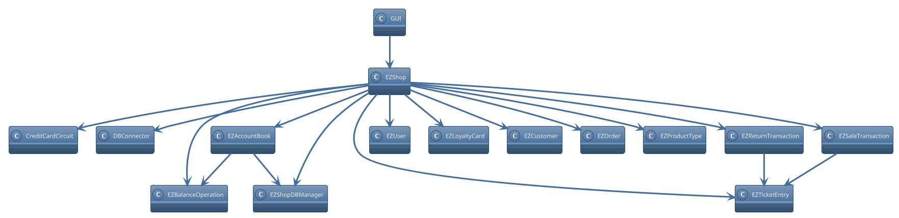

# Integration and API Test Documentation

Authors:
* S281564 Marco Manco
* S290136 Giovanni Pollo
* S292477 Matteo Quarta
* S292602  Davide Fersino

Date:

Version: 1.0

# Contents

- [Dependency graph](#dependency-graph)

- [Integration and API Test Documentation](#integration-and-api-test-documentation)
- [Contents](#contents)
- [Dependency graph](#dependency-graph)
- [Integration approach](#integration-approach)
- [Tests](#tests)
  - [Step 1](#step-1)
  - [Step 2](#step-2)
  - [Step 3](#step-3)
- [Coverage of Scenarios and FR](#coverage-of-scenarios-and-fr)
- [Coverage of Non Functional Requirements](#coverage-of-non-functional-requirements)

  - 

- [Tests](#tests)

- [Scenarios](#scenarios)

- [Coverage of scenarios and FR](#scenario-coverage)
- [Coverage of non-functional requirements](#nfr-coverage)

# Dependency graph

# Integration approach

For our tests we have chosen a bottom up approach.

Step 1: Unit testing

Step 2: Intermediate testing

Step : API testing

# Tests

<define below a table for each integration step. For each integration step report the group of classes under test, and the names of
JUnit test cases applied to them> JUnit test classes should be here src/test/java/it/polito/ezshop

## Step 1

| Classes | JUnit test cases |
| ------- | ---------------- |
| EZTicketEntry.java | TestEZTicketEntry.testSetBarCode(), TestEZTicketEntry.testSetProductDescription(), TestEZTicketEntry.testSetAmount(), TestEZTicketEntry.testSetPricePerUnit(), TestEZTicketEntry.testSetDiscountRate() |
| EZOrder.java | TestEZOrder.testSetBalanceId(), TestEZOrder.testSetProductCode(), TestEZOrder.testSetPricePerUnit(), TestEZOrder.testSetQuantity(), TestEZOrder.testSetStatus(), TestEZOrder.testSetOrderID() |
| EZBalanceOperation.java | TestEZBalanceOperation.testSetBalanceId(), TestEZBalanceOperation.testSetDate(), TestEZBalanceOperation.testSetMoney(), TestEZBalanceOperation.testSetType() |
| EZUser.java | TestEZUser.setId(), TestEZUser.setUsername(), TestEZUser.setPassword(), TestEZUser.setRole() |
| EZProductType.java | TestEZProductType.setQuantity(), TestEZProductType.setLocation(), TestEZProductType.setNote(), TestEZProductType.setProductDescription(), TestEZProductType.setBarCode(), TestEZProductType.setPricePerUnit(), TestEZProductType.setId() |
| EZCustomer.java | TestEZCustomer.testXSetter(), TestEZCustomer.testCustomerCardSetter(), TestEZCustomer.testCustomerNameSetter(), TestEZCustomer.testSetId(), TestEZCustomer.testSetPoints() |
| CreditCardCircuit.java | TestCreditCardCircuit.testCardPresentInFile(), TestCreditCardCircuit.testCardNotPresentInFile(), TestCreditCardCircuit.testNegativeMinBalance(), TestCreditCardCircuit.testCardNotPresentDuringHasEnoughBalance(), TestCreditCardCircuit.testCardBalanceInsufficientDuringHasEnoughBalance(), TestCreditCardCircuit.testCardBalanceSufficientDuringHasEnoughBalance(), TestCreditCardCircuit.testNegativePayAmount(), TestCreditCardCircuit.testCardNotPresentDuringPay(), TestCreditCardCircuit.testCardBalanceInsufficientDuringPay(), TestCreditCardCircuit.testCardBalanceSufficientDuringPay(), TestCreditCardCircuit.testNegativeRefundAmount(), TestCreditCardCircuit.testCardNotPresentDuringRefund(), TestCreditCardCircuit.testRefundSuccess() |

## Step 2

| Classes | JUnit test cases |
| ------- | ---------------- |
| EZAccountBook.java | TestEZAccountBook.testSingleton(), TestEZAccountBook.testGetBOList(), TestEZAccountBook.testComputeBalanceAllPositive(), TestEZAccountBook.testComputeBalanceAllNegative(), TestEZAccountBook.testComputeBalanceMixed1(), TestEZAccountBook.testComputeBalanceMixed2(), TestEZAccountBook.testComputeBalanceMixed3() |
| EZReturnTransaction.java | TestEZReturnTransaction.testSetReturnId(), TestEZReturnTransaction.testSetTransactionId(), TestEZReturnTransaction.testSetProducts(), TestEZReturnTransaction.testSetCommit, TestEZReturnTransaction.testSetStatus, TestEZReturnTransaction.testSetDiscountRate(), TestEZReturnTransaction.testAddProductReturnedAndGetPrice(), TestEZReturnTransaction.testAddProductReturnedAndGetPriceWithDiscount() |
| EZSaleTransaction.java | TestEZSaleTransaction.setUp(), TestEZSaleTransaction.tearDown(), TestEZSaleTransaction.testSetProducts(), TestEZSaleTransaction.testSetEntries(), TestEZSaleTransaction.testSetPaymentType(), TestEZSaleTransaction.testSetStatus(), TestEZSaleTransaction.testSetTicketNumber(), TestEZSaleTransaction.testSetDiscountRate(), TestEZSaleTransaction.testSetPrice(), TestEZSaleTransaction.testSetPriceWithProduct(), TestEZSaleTransaction.testComputePointsWithPrice(), TestEZSaleTransaction.testComputePointsWithProduct(), TestEZSaleTransaction.testReceiveCashPaymentValid(), TestEZSaleTransaction.testReceiveCashPaymentInvalid(), TestEZSaleTransaction.testReceiveCreditCardPayment(), TestEZSaleTransaction.testGetEntry(), TestEZSaleTransaction.testDeleteProductFromSaleValid(), TestEZSaleTransaction.testDeleteProductFromSaleInvalid(), TestEZSaleTransaction.testApplyDiscountRateToProduct(), TestEZSaleTransaction.testEndSaleTransaction(), TestEZSaleTransaction.testValidLuhnAlgorithm() |
| EZTicketEntry.java | TestEZTicketEntry.testSetBarCode(), TestEZTicketEntry.testSetProductDescription(), TestEZTicketEntry.testSetAmount(), TestEZTicketEntry.testSetPricePerUnit(), TestEZTicketEntry.testSetDiscountRate() |
| EZShopDBManager.java | TestEZShopDBManager.testGetNextUserID(), TestEZShopDBManager.testLoadAllUsers(), TestEZShopDBManager.testLoadUserFromID(), TestEZShopDBManager.testLoadUserFromUsernameAndPass(), TestEZShopDBManager.testUserExistsFromID(), TestEZShopDBManager.testUserExistsFromUsername(), TestEZShopDBManager.testUpdateUserRights(), TestEZShopDBManager.testDeleteUser(), TestEZShopDBManager.testGetNextCustomerID(), TestEZShopDBManager.testLoadAllCustomers(), TestEZShopDBManager.testLoadCustomerFromID(), TestEZShopDBManager.testLoadCustomerFromCard(), TestEZShopDBManager.testCustomerExistsFromID(), TestEZShopDBManager.testCustomerExistsFromName(), TestEZShopDBManager.testCustomerExistsFromCard(), TestEZShopDBManager.testUpdateCustomer(), TestEZShopDBManager.testDeleteCustomer(), TestEZShopDBManager.testGetNextOrderID(), TestEZShopDBManager.testLoadAllOrders(), TestEZShopDBManager.testLoadOrderFromID(), TestEZShopDBManager.testUpdateOrder(), TestEZShopDBManager.testGetNextProductID(), TestEZShopDBManager.testLoadAllProducts(), TestEZShopDBManager.testLoadProductFromID(), TestEZShopDBManager.testLoadProductFromBarCode(), TestEZShopDBManager.testProductExistsFromID(), TestEZShopDBManager.testProductExistsFromBarCode(), TestEZShopDBManager.testProductExistsFromLocation(), TestEZShopDBManager.testUpdateProduct(), TestEZShopDBManager.testDeleteProduct(), TestEZShopDBManager.testGetNextSaleID(), TestEZShopDBManager.testLoadAllSales(), TestEZShopDBManager.testLoadSaleFromID(), TestEZShopDBManager.testUpdateSale(), TestEZShopDBManager.testDeleteSale(), TestEZShopDBManager.testGetNextBalanceOperationID(), TestEZShopDBManager.testLoadAllBalanceOperations(), TestEZShopDBManager.testGetNextReturnID(), TestEZShopDBManager.testLoadReturnFromID(), TestEZShopDBManager.testUpdateReturnStatus(), TestEZShopDBManager.testDeleteReturn() |

## Step 3

| Classes | JUnit test cases |
| ------- | ---------------- |
| EZShop.java | TestEZShop.testCreateUser(), TestEZShop.testDeleteUser(), TestEZShop.testGetAllUsers(), TestEZShop.testGetUser(), TestEZShop.testUpdateUserRights(), TestEZShop.testLogin(), TestEZShop.testLogout(), TestEZShop.createProductType(), TestEZShop.updateProduct(), TestEZShop.deleteProductType(), TestEZShop.getAllProductTypes(), TestEZShop.getProductTypeByBarCode(), TestEZShop.getProductTypesByDescription(), TestEZShop.updateQuantity(), TestEZShop.updatePosition(), TestEZShop.defineCustomer(), TestEZShop.modifyCustomer(), TestEZShop.deleteCustomer(), TestEZShop.getCustomer(), TestEZShop.getAllCustomers(), TestEZShop.createCard(), TestEZShop.attachCardToCustomer(), TestEZShop.modifyPointsOnCard(), TestEZShop.testStartSaleTransaction(), TestEZShop.testAddProductToSale(), TestEZShop.testDeleteProductFromSale(), TestEZShop.testApplyDiscountRateToProduct(), TestEZShop.testapplyDiscountRateToSale(), TestEZShop.testComputePointsForSale(), TestEZShop.testEndSaleTransaction(), TestEZShop.testDeleteSaleTransaction(), TestEZShop.testGetSaleTransactio(), TestEZShop.testStartReturnTransaction(), TestEZShop.testReturnProduct(), TestEZShop.testEndReturnTransaction(), TestEZShop.testDeleteReturnTransaction(), TestEZShop.testReceiveCashPayment(), TestEZShop.testReceiveCreditCardPayment(), TestEZShop.testReturnCashPayment(), TestEZShop.testReturnCreditCardPayment(), TestEZShop.testIssueOrder(), TestEZShop.testPayOrderFor(), TestEZShop.testPayOrder(), TestEZShop.testRecordOrderArrival(), TestEZShop.testRecordBUAndCB(), TestEZShop.testGetDebitsCreditsAndCB(), TestEZShop.testValidBarCode() |

# Coverage of Scenarios and FR

| Scenario ID | FR covered | JUnit Test(s)             |
| ----------- | ---------- | ------------------------- |
| ..          | FRx        |                           |
| ..          | FRy        |                           |
| ...         |            |                           |
| ...         |            |                           |
| ...         |            |                           |
| ...         |            |                           |
| ...         | FR4        | testIssueOrder            |
| ...         |            | testPayOrder              |
| ...         |            | testPayOrderFor           |
| ...         | FR8        | testRecordBUAndCB         |
| ...         |            | testGetDebitsCreditsAndCB |
# Coverage of Non Functional Requirements

<Report in the following table the coverage of the Non Functional Requirements of the application - only those that can be tested with automated testing frameworks.>

###

| Non Functional Requirement | Test name        |
| -------------------------- | ---------------- |
|                            |                  |
| NFR4 | TestEZShop.testValidBarCode() |
| NFR5 | TestEZSaleTransaction.testValidLuhnAlgorithm() |
| NFR6 | TestEZSaleTransaction.createCard() |
