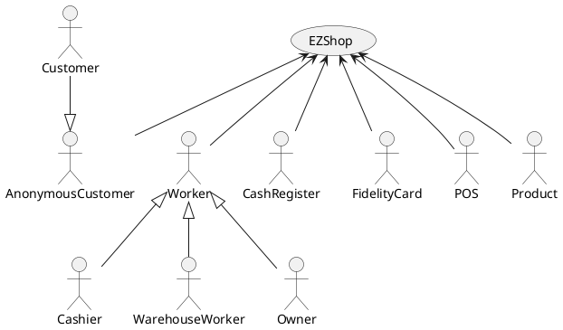
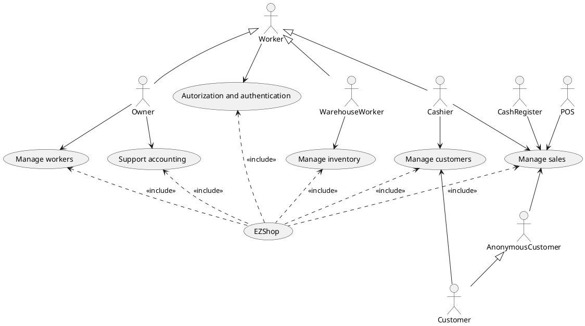
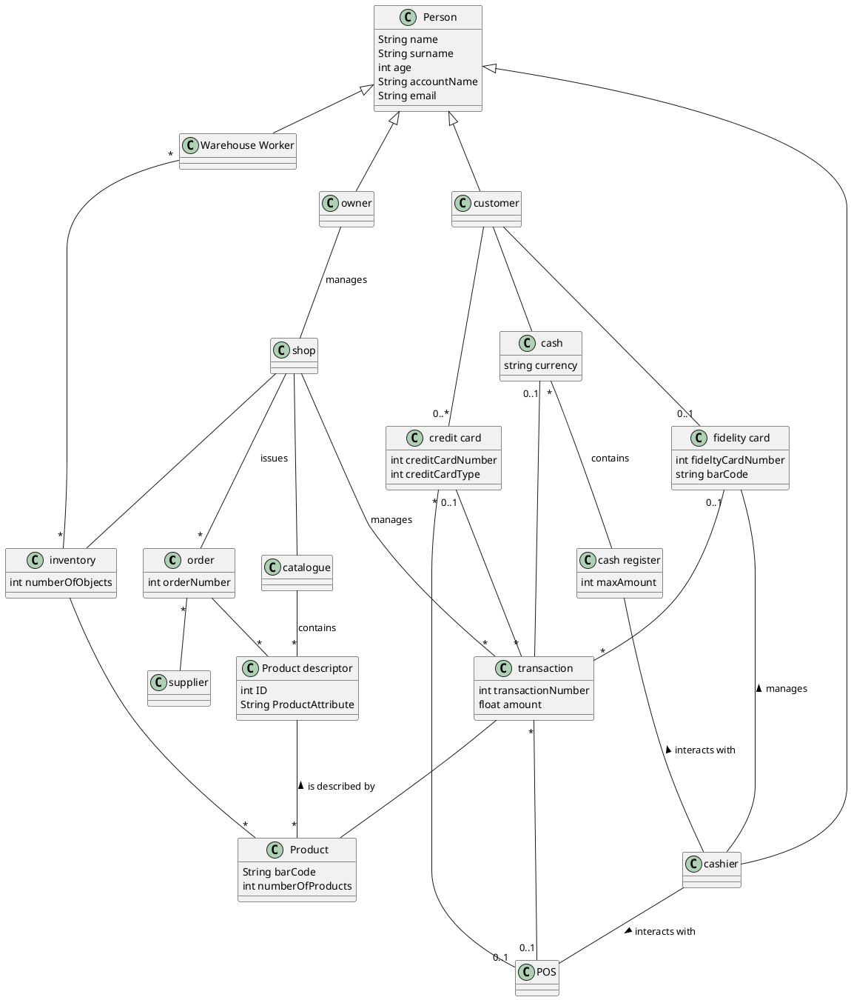
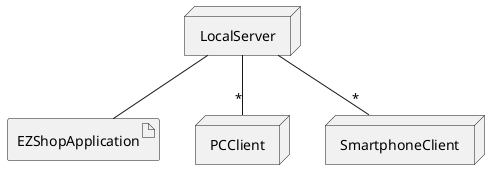

# Requirements Document 

Authors: S292477 Matteo Quarta, S281564 Manco Marco, S290136 Davide Fersino, S29260 Giovanni Pollo

Date: 21/04/2021

Version: 1.0

- [Requirements Document](#requirements-document)
- [Essential description](#essential-description)
- [Stakeholders](#stakeholders)
- [Context Diagram and interfaces](#context-diagram-and-interfaces)
	- [Context Diagram](#context-diagram)
	- [Interfaces](#interfaces)
- [Stories and personas](#stories-and-personas)
	- [Functional Requirements](#functional-requirements)
	- [Non Functional Requirements](#non-functional-requirements)
- [Use Case diagram and Use Cases](#use-case-diagram-and-use-cases)
	- [Use Case diagram](#use-case-diagram)
		- [Use Case 1, UC1](#use-case-1-uc1)
			- [Scenario 1.1](#scenario-11)
		- [Use Case 2, UC2](#use-case-2-uc2)
		- [Use Case 3, UC3](#use-case-3-uc3)
			- [Scenario 3.1](#scenario-31)
			- [Scenario 3.2](#scenario-32)
		- [Use Case 4, UC4](#use-case-4-uc4)
			- [Scenario 4.1](#scenario-41)
			- [Scenario 4.2](#scenario-42)
			- [Scenario 4.3](#scenario-43)
		- [Use Case 5, UC5](#use-case-5-uc5)
			- [Scenario 5.1](#scenario-51)
		- [Use Case 6, UC6](#use-case-6-uc6)
			- [Scenario 6.1](#scenario-61)
		- [Use Case 7, UC7](#use-case-7-uc7)
			- [Scenario 7.1](#scenario-71)
			- [Scenario 7.2](#scenario-72)
			- [Scenario 7.3](#scenario-73)
		- [Use Case 8, UC8](#use-case-8-uc8)
			- [Scenario 8.1](#scenario-81)
		- [Use Case 9, UC9](#use-case-9-uc9)
			- [Scenario 9.1](#scenario-91)
			- [Scenario 9.2](#scenario-92)
		- [Use Case 10, UC10](#use-case-10-uc10)
			- [Scenario 10.1](#scenario-101)
			- [Scenario 10.2](#scenario-102)
		- [Use Case 11, UC11](#use-case-11-uc11)
		- [Use Case 12, UC12](#use-case-12-uc12)
			- [Scenario 12.1](#scenario-121)
			- [Scenario 12.2](#scenario-122)
			- [Scenario 12.3](#scenario-123)
			- [Scenario 12.4](#scenario-124)
			- [Scenario 12.5](#scenario-125)
			- [Scenario 12.6](#scenario-126)
		- [Use Case 13, UC13](#use-case-13-uc13)
			- [Scenario 13.1](#scenario-131)
			- [Scenario 13.2](#scenario-132)
		- [Use Case 14, UC14](#use-case-14-uc14)
			- [Scenario 14.1](#scenario-141)
			- [Scenario 14.2](#scenario-142)
		- [Use Case 15, UC15](#use-case-15-uc15)
		- [Use Case 16, UC16](#use-case-16-uc16)
			- [Scenario 16.1](#scenario-161)
			- [Scenario 16.2](#scenario-162)
		- [Use Case 17, UC17](#use-case-17-uc17)
			- [Scenario 17.1](#scenario-171)
			- [Scenario 17.2](#scenario-172)
- [Glossary](#glossary)
- [System Design](#system-design)
- [Deployment Diagram](#deployment-diagram)

# Essential description

Small shops require a simple application to support the owner or manager. A small shop (ex a food shop) occupies 50-200 square meters, sells 500-2000 different item types, has one or a few cash registers.
EZShop is a software application able to:
* manage sales
* manage inventory
* manage customers
* support accounting

# Stakeholders

| Stakeholder name    |                                     Description                                     |
| ------------------- | :---------------------------------------------------------------------------------: |
| Owner               |                                  Owner of the shop                                  |
| Cashier             |                    Workers that manage sales through the system                     |
| Warehouse Worker    |                          Workers that manage the inventory                          |
| Customer            |                           Customers with a fidelity card                            |
| Anonymous Customers | People that interact with the sytems buying products without having a fidelity card |
| Fidelity Card       |                            Card associated to a customer                            |
| POS                 |                                    Point of sale                                    |
| Product             |                              Product sold by the shop                               |
| Cash register       |                            Register used to handle sales                            |
| Supplier            |                          Person/company for the supplying                           |

# Context Diagram and interfaces

## Context Diagram

## Interfaces

| Actor            | Logical Interface                                      | Physical Interface                 |
| ---------------- | ------------------------------------------------------ | ---------------------------------- |
| Owner, manager   | GUI of the application                                 | Screen, keyboard on PC             |
| Cashier          | GUI of the application                                 | Screen, touch of the cash register |
| Warehouse Worker | GUI of the application                                 | Touch screen of the smartphone     |
| Maintainers      | Phone call/screen share                                | Screen, keyboard on PC             |
| Fidelity Card    | Serial number                                          | Bar Code                           |
| POS              | Mastercard API (https://developer.mastercard.com/apis) | Card reader                        |
| Product          | Serial number                                          | Bar Code                           |

# Stories and personas
Giovanni is 21, he is a customer of the shop. He is a student so is usually is out of cash. For this reason he is interested in the fidelty card.

Angelo is a doctor and he is 40. He is a fan of credit card. For this reason when he goes to the shop he likes to pay with it.

Franco is a shop manager and he likes to have all pieces of informations under control. For this reason he is interested in the system because he will use a lot all the accounting functions. 

Anna is 25 and she works as a cashier. She is not very good in math so she wants, on her tablet the preview of all the articles the customer is buying and also the preview of the total price to pay. 

Giulia is 45 and she is a warehouse worker. She handles supplying, so she is interested in being able to manage periodic orders from a wholesaler.

## Functional Requirements

| ID      |                      Description                       |
| ------- | :----------------------------------------------------: |
| FR1     |            Authorizaton and authentication             |
| FR1.1   |                         Login                          |
| FR1.2   |                         Logout                         |
| FR2     |                     Manage workers                     |
| FR2.1   | Add a new worker (manager, warehouse workers, cashier) |
| FR2.2   |                    Modify a worker                     |
| FR2.3   |               Delete an exsisting worker               |
| FR2.4   |                    Search a worker                     |
| FR2.5   |                    List all worker                     |
| FR3     |                    Manage customers                    |
| FR3.1   |              Create/delete fidelity card               |
| FR3.2   |           Search and modify customer details           |
| FR3.3   |                   List all customer                    |
| FR4     |                    Manage inventory                    |
| FR4.1   |                      Add product                       |
| FR4.1.1 |               Read bar code of a product               |
| FR4.2   |                     Delete product                     |
| FR4.3   |                     Modify product                     |
| FR4.4   |                   List all products                    |
| FR4.5   |                    Manage supplying                    |
| FR4.5.1 |                      Create order                      |
| FR4.5.2 |                      Delete order                      |
| FR4.5.3 |                      Modify order                      |
| FR4.5.4 |                 Manage periodic orders                 |
| FR5     |                      Manage sales                      |
| FR5.1   |                    Open transaction                    |
| FR5.2   |                    Manage products                     |
| FR5.2.1 |                     Read bar code                      |
| FR5.2.2 |          Add the product to the shopping cart          |
| FR5.3   |              Visualize the amount to pay               |
| FR5.4   |                 Manage payment options                 |
| FR5.4.1 |                 Start POS transaction                  |
| FR5.4.2 |                  Enter payment amount                  |
| FR5.4.3 |                  End POS transaction                   |
| FR5.5   |           Read bar code of the fidelity card           |
| FR5.6   |                   Print the receipt                    |
| FR5.7   |                   Close transaction                    |
| FR6     |                   Support accounting                   |
| FR6.1   |                   List transactions                    |
| FR6.2   |                   Visualize incomes                    |
| FR6.3   |              Visualize product statistics              |
| FR6.4   |                  Customers statistics                  |

## Non Functional Requirements

| ID   | Type (efficiency, reliability, ..) |                                 Description                                 | Refers to |
| ---- | :--------------------------------: | :-------------------------------------------------------------------------: | --------: |
| NFR1 |             Usability              |       Application should be used with minimal training for the worker       |    All FR |
| NFR2 |              Privacy               | Data of one user must be encrypted and  visibile only to the manager/owner. |       FR3 |
| NFR3 |            Portability             |                               Cross platform                                |    All FR |
| NFR4 |            Reliability             |                The system can work just with a local network                |    All FR |

# Use case diagram and use cases

## Use case diagram

### Use case 1, UC1
| Actors Involved  |                     Worker                     |
| ---------------- | :--------------------------------------------: |
| Precondition     |             A worker is logged out             |
| Post condition   |             A worker is logged in              |
| Nominal Scenario |                     Login                      |
| Variants         | Worker doesn't exist, user is not authenticate |

##### Scenario 1.1 
| Scenario 1.1   |                     Worker                      |
| -------------- | :---------------------------------------------: |
| Precondition   |              Worker is logged out               |
| Post condition | Worker account is created & worker is logged in |
| Step           |                   Description                   |
| 1              |            The worker is logged out             |
| 2              |    Worker tries to log in but is not able to    |
| 3              |    The account of the worker must be created    |
| 4              |           The worker is able to login           |

### Use case 2, UC2

| Actors Involved  |         Worker         |
| ---------------- | :--------------------: |
| Precondition     | A worker is logged in  |
| Post condition   | A worker is logged out |
| Nominal Scenario |         Logout         |
| Variants         |                        |

### Use case 3, UC3

| Actors Involved  |            Worker             |
| ---------------- | :---------------------------: |
| Precondition     | Worker account doesn't exists |
| Post condition   |               -               |
| Nominal Scenario |        Create account         |
| Variants         |    Unable to add the user     |

##### Scenario 3.1 

| Scenario 3.1   |                                               |
| -------------- | :-------------------------------------------: |
| Precondition   |         Worker account doesn't exists         |
| Post condition |         Worker account doesn't exists         |
| Step           |                  Description                  |
| 1              |      The worker doesn't have an account       |
| 2              |  The manager is asked to create the account   |
| 3              | The manager is not able to create the account |

##### Scenario 3.2 

| Scenario 3.2   |                                            |
| -------------- | :----------------------------------------: |
| Precondition   |       Worker account doesn't exists        |
| Post condition |           Worker account exists            |
| Step           |                Description                 |
| 1              |     The worker doesn't have an account     |
| 2              | The manager is asked to create the account |
| 3              |         The worker has an account          |

### Use case 4, UC4

| Actors Involved  |                      Worker                       |
| ---------------- | :-----------------------------------------------: |
| Precondition     |                         -                         |
| Post condition   |       Worker personal details are modified        |
| Nominal Scenario |                   Modification                    |
| Variants         | Delete a worker, cannot find the worker to modify |

##### Scenario 4.1

| Scenario 4.1   |                                                       |
| -------------- | :---------------------------------------------------: |
| Precondition   |              Worker account has to exist              |
| Post condition |         Worker personal details are modified          |
| Step           |                      Description                      |
| 1              | Some personal data of the worker needs to be modified |
| 2              |                   Search the worker                   |
| 3              |             Modify his/her personal data              |

##### Scenario 4.2

| Scenario 4.2   |                                                       |
| -------------- | :---------------------------------------------------: |
| Precondition   |             Worker account does not exist             |
| Post condition |         Worker personal details are modified          |
| Step           |                      Description                      |
| 1              | Some personal data of the worker needs to be modified |
| 2              |                   Search the worker                   |
| 3              |                Cannot find the worker                 |
| 4              |           Create the account of the worker            |

##### Scenario 4.3

| Scenario 4.3   |                                                      |
| -------------- | :--------------------------------------------------: |
| Precondition   |             Worker account has to exist              |
| Post condition |         Worker personal details are modified         |
| Step           |                     Description                      |
| 1              | Some personal data of the worker need to be modified |
| 2              |                  Search the worker                   |
| 3              |            Delete completely his account             |

### Use case 5, UC5

| Actors Involved  |                                     Cashier, Customer                                     |
| ---------------- | :---------------------------------------------------------------------------------------: |
| Precondition     | Customer has not a fidelity card, Cashier can create a new fidelity card and is logged in |
| Post condition   |                               Customer has a fidelity card                                |
| Nominal Scenario |                                         Creation                                          |
| Variants         |                                                                                           |

##### Scenario 5.1

| Scenario 5.1   |                                                                                           |
| -------------- | :---------------------------------------------------------------------------------------: |
| Precondition   | Customer has not a fidelity card, Cashier can create a new fidelity card and is logged in |
| Post condition |                               Customer has a fidelity card                                |
| Step#          |                                        Description                                        |
| 1              |                           The customer has not a fidelity card                            |
| 2              |                     The cashier is asked to create the fidelity card                      |
| 3              |                                The customer fill the form                                 |
| 4              |                      The cashier adds the new customer in the system                      |
| 5              |                             The customer has a fidelity card                              |

### Use case 6, UC6

| Actors Involved  |                                 Cashier, Customer                                 |
| ---------------- | :-------------------------------------------------------------------------------: |
| Precondition     | Customer has a fidelity card, Cashier can delete a fidelity card and is logged in |
| Post condition   |                  Customer does not own a fidelity card  anymore                   |
| Nominal Scenario |                                     Deletion                                      |
| Variants         |                                                                                   |

##### Scenario 6.1

| Scenario 6.1   |                                                                                       |
| -------------- | :-----------------------------------------------------------------------------------: |
| Precondition   | Customer owns of a fidelity card, Cashier can delete a fidelity card and is logged in |
| Post condition |                     Customer does not own a fidelity card anymore                     |
| Step#          |                                      Description                                      |
| 1              |                    The customer wants to delete her fidelity card                     |
| 2              |                   The cashier is asked to delete the fidelity card                    |
| 4              |                    The cashier deletes the customer in the system                     |
| 5              |         The customer has not a fidelity card anymore and her data is deleted          |

### Use case 7, UC7

| Actors Involved  |                                                      Cashier, Customer                                                       |
| ---------------- | :--------------------------------------------------------------------------------------------------------------------------: |
| Precondition     | Customer already has a fidelity card and her data is in the system, Cashier can modify a fidelity card data and is logged in |
| Post condition   |                                                  Customer's data is updated                                                  |
| Nominal Scenario |                                                         Modification                                                         |
| Variants         |                                    Delete a customer, cannot find the customers to modify                                    |

##### Scenario 7.1

| Scenario 7.1   |                                                                                                                              |
| -------------- | :--------------------------------------------------------------------------------------------------------------------------: |
| Precondition   | Customer already has a fidelity card and her data is in the system, Cashier can modify a fidelity card data and is logged in |
| Post condition |                                                  Customer's data is updated                                                  |
| Step#          |                                                         Description                                                          |
| 1              |                                   Some personal data of the customer needs to be modified                                    |
| 2              |                            The cashier is asked to modify the fidelity card data of the customer                             |
| 3              |                                       The cashier searches the customer in the system                                        |
| 4              |                              The customer tells the new personal data that needs to be modified                              |
| 5              |                                    The cashier modifies the customer's data in the system                                    |
| 6              |                                                The customer's data is updated                                                |

##### Scenario 7.2

| Scenario 7.2   |                                                                                                                              |
| -------------- | :--------------------------------------------------------------------------------------------------------------------------: |
| Precondition   | Customer already has a fidelity card and her data is in the system, Cashier can modify a fidelity card data and is logged in |
| Post condition |                                                  Customer's data is updated                                                  |
| Step#          |                                                         Description                                                          |
| 1              |                                   Some personal data of the customer needs to be modified                                    |
| 2              |                            The cashier is asked to modify the fidelity card data of the customer                             |
| 3              |                                       The cashier searches the customer in the system                                        |
| 4              |                              The customer tells the new personal data that needs to be modified                              |
| 5              |                          The cashier makes a mistake and deletes the customer's data in the system                           |
| 6              |                                   The cashier adds the customer's data again in the system                                   |
| 7              |                                 The customer has a new fidelity card and her data is updated                                 |

##### Scenario 7.3

| Scenario 7.3   |                                                                                                                             |
| -------------- | :-------------------------------------------------------------------------------------------------------------------------: |
| Precondition   | Customer alread has a fidelity card and her data is in the system, Cashier can modify a fidelity card data and is logged in |
| Post condition |                                                 Customer's data is updated                                                  |
| Step#          |                                                         Description                                                         |
| 1              |                                   Some personal data of the customer needs to be modified                                   |
| 2              |                            The cashier is asked to modity the fidelity card data of the customer                            |
| 3              |                                       The cashier searches the customer in the system                                       |
| 4              |                                       The customer's data is not listed in the system                                       |
| 5              |                        The cashier adds the customer's data again in the system with updated version                        |
| 6              |                                The customer has a new fidelity card and her data is updated                                 |

### Use case 8, UC8

| Actors Involved  |                                     Warehouse Worker                                      |
| ---------------- | :---------------------------------------------------------------------------------------: |
| Precondition     | Warehouse Worker is logged in and can add a new product, the product is not in the system |
| Post condition   |                                 Product is in the system                                  |
| Nominal Scenario |                                         Creaction                                         |
| Variants         |                                                                                           |

##### Scenario 8.1

| Scenario 8.1   |                                                                                           |
| -------------- | :---------------------------------------------------------------------------------------: |
| Precondition   | Warehouse Worker is logged in and can add a new product, the product is not in the system |
| Post condition |                                 Product is in the system                                  |
| Step#          |                                        Description                                        |
| 1              |                       A new product must be added in the inventory                        |
| 2              |                   The Warehouse Worker fill the form with product data                    |
| 3              |                   The Warehouse Worker read the bar code of the product                   |
| 4              |                                   The product is added                                    |

### Use case 9, UC9

| Actors Involved  |                                   Warehouse Worker                                   |
| ---------------- | :----------------------------------------------------------------------------------: |
| Precondition     | Warehouse Worker is logged in and can delete a product, the product is in the system |
| Post condition   |                                  Product is deleted                                  |
| Nominal Scenario |                                       Deletion                                       |
| Variants         |                              Unable to find the product                              |

##### Scenario 9.1

| Scenario 9.1   |                                                                                     |
| -------------- | :---------------------------------------------------------------------------------: |
| Precondition   | Warehouse Worker is logged in and can delete products, the product is in the system |
| Post condition |                                 Product is deleted                                  |
| Step#          |                                     Description                                     |
| 1              |                    A product must be deleted from the inventory                     |
| 2              |                      The warehouse worker searches the product                      |
| 3              |                               The product is deleted                                |

##### Scenario 9.2

| Scenario 9.2   |                                                                                     |
| -------------- | :---------------------------------------------------------------------------------: |
| Precondition   | Warehouse Worker is logged in and can delete products, the product is in the system |
| Post condition |                           The product is not in the list                            |
| Step#          |                                     Description                                     |
| 1              |                    A product must be deleted from the inventory                     |
| 2              |                      The warehouse worker searches the product                      |
| 3              |                           The product is not in the list                            |

### Use case 10, UC10

| Actors Involved  |                                  Warehouse Worker                                   |
| ---------------- | :---------------------------------------------------------------------------------: |
| Precondition     | Warehouse Worker is logged in and can modify products, the product is in the system |
| Post condition   |                                 Product is updated                                  |
| Nominal Scenario |                                    Modification                                     |
| Variants         |                          Cannot find the product to modify                          |

##### Scenario 10.1

| Scenario 10.1  |                                                                                     |
| -------------- | :---------------------------------------------------------------------------------: |
| Precondition   | Warehouse Worker is logged in and can modify products, the product is in the system |
| Post condition |                                 Product is updated                                  |
| Step#          |                                     Description                                     |
| 1              |                      Some data of a product should be modified                      |
| 2              |                      The warehouse worker searches the product                      |
| 3              |                         Warehouse worker modifies the data                          |
| 4              |                                 Product is updated                                  |

##### Scenario 10.2

| Scenario 10.2  |                                                                                     |
| -------------- | :---------------------------------------------------------------------------------: |
| Precondition   | Warehouse Worker is logged in and can modify products, the product is in the system |
| Post condition |                                 Product is updated                                  |
| Step#          |                                     Description                                     |
| 1              |                      Some data of a product should be modified                      |
| 2              |                      The warehouse worker searches the product                      |
| 3              |                             Product is not in the list                              |
| 4              |          Warehouse worker adds the product in the system with updated data          |
| 5              |                                 Product is updated                                  |

### Use case 11, UC11

| Actors Involved  |   Warehouse Worker, Owner, Manager, Cashier    |
| ---------------- | :--------------------------------------------: |
| Precondition     |              Worker is logged in               |
| Post condition   |           List of products is shown            |
| Nominal Scenario |                    Showing                     |
| Variants         | System bug with the result of no product shown |

### Use Case 12, UC12

| Actors Involved  |                                     Cashier, Customer                                      |
| :--------------: | :----------------------------------------------------------------------------------------: |
|   Precondition   | Customer chose one or more products to buy, cashier is free and can manage the transaction |
|  Post condition  |                                             -                                              |
| Nominal Scenario |                                        Manage sale                                         |
|     Variants     |                         Customer can pay with cash or credit card                          |
|                  |                   Customer doesn't have enough cash to pay all products                    |
|                  |            Customer doesn't have enough credit on his card to pay all products             |
|                  |                      Payment with card fails due to network condition                      |

##### Scenario 12.1

| Scenario 12.1  |                                      Customer pay with cash                                      |
| :------------: | :----------------------------------------------------------------------------------------------: |
|  Precondition  |    Customer chose one or more products to buy, cashier is free and can manage the transaction    |
| Post condition | Customer bought one or more products and received a receipt, transaction is logged in the system |
|     Step #     |                                           Description                                            |
|       1        |                                The cashier opens new transaction                                 |
|       2        |                  The cashier scans the bar code of all customer chosen products                  |
|       3        |                   The cashier says to customer the total shopping cart amount                    |
|       4        |                              The costumer chooses to pay with cash                               |
|       5        |                                         Payment is done                                          |
|       6        |                  The cashier closes transaction and prints transaction receipt                   |
|       7        |                   The customer has their products and the transaction receipt                    |

##### Scenario 12.2

| Scenario 12.2  |                                 Customer pays with credit card                                  |
| :------------: | :---------------------------------------------------------------------------------------------: |
|  Precondition  |   Customer chose one or more products to buy, cashier is free and can manage the transaction    |
| Post condition | Customer bought one or more products and receive a receipt, transaction is logged in the system |
|     Step #     |                                           Description                                           |
|       1        |                                The cashier opens new transaction                                |
|       2        |                 The cashier scans the bar code of all customer chosen products                  |
|       3        |                   The cashier says to customer the total shopping cart amount                   |
|       4        |                          The costumer chooses to pay with credit card                           |
|       5        |                      The cashier prepare the POS for managing the payment                       |
|       6        |                                 The customer interacts with POS                                 |
|       7        |                         Payment is done and POS prints its own receipt                          |
|       8        |                  The cashier closes transaction and prints transaction receipt                  |
|       9        |            The customer has their products, the transaction receipt and POS receipt             |

##### Scenario 12.3

| Scenario 12.3  | Customer chose to pay with cash but does not have enough for all products, customer chooses to cancel transaction |
| :------------: | :---------------------------------------------------------------------------------------------------------------: |
|  Precondition  |            Customer chose one or more products to buy, cashier is free and can manage the transaction             |
| Post condition |                               Customer didn't buy products, transaction is deleted                                |
|     Step #     |                                                    Description                                                    |
|       1        |                                         The cashier opens new transaction                                         |
|       2        |                          The cashier scans the bar code of all customer chosen products                           |
|       3        |                            The cashier says to customer the total shopping cart amount                            |
|       4        |                                       The costumer chooses to pay with cash                                       |
|       5        |                        The customer has not enough cash and chooses to cancels transaction                        |
|       6        |                                          The cashier deletes transaction                                          |

##### Scenario 12.4

| Scenario 12.4  | Customer chose to pay with cash but isn't enough for all products, customer chooses to leave one or more products |
| :------------: | :---------------------------------------------------------------------------------------------------------------: |
|  Precondition  |            Customer chose one or more products to buy, cashier is free and can manage the transaction             |
| Post condition |        Customer bought part of initial products and receive a receipt, transaction is logged in the system        |
|     Step #     |                                                    Description                                                    |
|       1        |                                         The cashier opens new transaction                                         |
|       2        |                          The cashier scans the bar code of all customer chosen products                           |
|       3        |                            The cashier says to customer the total shopping cart amount                            |
|       4        |                                       The costumer chooses to pay with cash                                       |
|       5        |                                         The customer has not enough cash                                          |
|       6        |  The costumer leave one or more products until the total shopping cart amount is less than or equal to his cash   |
|       5        |                                                  Payment is done                                                  |
|       6        |                           The cashier closes transaction and prints transaction receipt                           |
|       7        |                       The customer has part of initial products and the transaction receipt                       |

##### Scenario 12.5

| Scenario 12.5  | Customer chose to pay with credit card but does not have enough credit for all products, customer chooses to cancel transaction |
| :------------: | :-----------------------------------------------------------------------------------------------------------------------------: |
|  Precondition  |                   Customer chose one or more products to buy, cashier is free and can manage the transaction                    |
| Post condition |                                      Customer didn't buy products, transaction is deleted                                       |
|     Step #     |                                                           Description                                                           |
|       1        |                                                The cashier opens new transaction                                                |
|       2        |                                 The cashier scans the bar code of all customer chosen products                                  |
|       3        |                                   The cashier says to customer the total shopping cart amount                                   |
|       4        |                                          The costumer chooses to pay with credit card                                           |
|       5        |                                      The cashier prepares the POS for managing the payment                                      |
|       6        |                                                 The customer interacts with POS                                                 |
|       7        |               Payment fails due to insufficient balance on credit card and customer chooses to cancel transaction               |
|       8        |                                                 The cashier deletes transaction                                                 |

##### Scenario 12.6

| Scenario 12.6  |   Customer chose to pay with credit card but transaction fails due to network condition    |
| :------------: | :----------------------------------------------------------------------------------------: |
|  Precondition  | Customer chose one or more products to buy, cashier is free and can manage the transaction |
| Post condition |                    Customer didn't buy products, transaction is deleted                    |
|     Step #     |                                        Description                                         |
|       1        |                             The cashier opens new transaction                              |
|       2        |               The cashier scans the bar code of all customer chosen products               |
|       3        |                The cashier says to customer the total shopping cart amount                 |
|       4        |                        The costumer chooses to pay with credit card                        |
|       5        |                    The cashier prepare the POS for managing the payment                    |
|       6        |                              The customer interacts with POS                               |
|       7        |            Payment fails due to network condition, transaction must be canceled            |
|       8        |                              The cashier deletes transaction                               |

### Use Case 13, UC13

| Actors Involved  |                                 Owner                                  |
| :--------------: | :--------------------------------------------------------------------: |
|   Precondition   | System can access previously saved transactions data and products data |
|  Post condition  |                                   -                                    |
| Nominal Scenario |                              Show incomes                              |
|     Variants     |                 No transactions in the selected window                 |

##### Scenario 13.1

| Scenario 13.1  |                                                                                        |
| :------------: | :------------------------------------------------------------------------------------: |
|  Precondition  |         System can access previously saved transactions data and products data         |
| Post condition |                                  System shows incomes                                  |
|     Step #     |                                      Description                                       |
|       1        |                The manager or owner requires the calculation of incomes                |
|       2        |                      The manager or owner selects the time window                      |
|       3        |                The system recovers transactions on selected time window                |
|       4        | For each transaction the system recovers purchase price of all products in transaction |
|       5        |                    The system computes the net and gross positions                     |
|       6        |                          System shows net and gross positions                          |

##### Scenario 13.2

| Scenario 13.2  |                 No transactions in the selected window                 |
| :------------: | :--------------------------------------------------------------------: |
|  Precondition  | System can access previously saved transactions data and products data |
| Post condition |                 System notifies the absence of incomes                 |
|     Step #     |                              Description                               |
|       1        |        The manager or owner requires the calculation of incomes        |
|       2        |              The manager or owner selects the time window              |
|       3        |        The system recovers transactions on selected time window        |
|       4        |                      System finds no transactions                      |
|       6        |                 System notifies the absence of incomes                 |

#### Use Case 14, UC14

| Actors Involved  |                             Manager, Owner                             |
| :--------------: | :--------------------------------------------------------------------: |
|   Precondition   | System can access previously saved transactions data and products data |
|  Post condition  |                                   -                                    |
| Nominal Scenario |                        Show product statistics                         |
|     Variants     |                           Product not found                            |

##### Scenario 14.1

| Scenario 14.1  |                                                                                 |
| :------------: | :-----------------------------------------------------------------------------: |
|  Precondition  |     System can access previously saved transactions data and products data      |
| Post condition |                      System shows product sale statistics                       |
|     Step #     |                                   Description                                   |
|       1        |    The manager or owner requires the calculation of product sale statistics     |
|       2        |                    The manager or owner selects the product                     |
|       3        |                    The system searches the selected product                     |
|       4        |               The system recovers transactions with this product                |
|       5        | For each transaction the system saves quantities sold for that product and date |
|       6        |               The system computes the total copies on every date                |
|       7        |                System shows sale statistics of selected product                 |

##### Scenario 14.2

| Scenario 14.2  |                            Product not found                             |
| :------------: | :----------------------------------------------------------------------: |
|  Precondition  |  System can access previously saved transactions data and products data  |
| Post condition |                  System notifies the absence of product                  |
|     Step #     |                               Description                                |
|       1        | The manager or owner requires the calculation of product sale statistics |
|       2        |                 The manager or owner selects the product                 |
|       3        |                  The system search the selected product                  |
|       3        |                    The system cannot find the product                    |
|       4        |                  System notifies the absence of product                  |

#### Use Case 15, UC15

| Actors Involved  |          Manager, Owner          |
| :--------------: | :------------------------------: |
|   Precondition   | System can access customers data |
|  Post condition  | System shows customer statistics |
| Nominal Scenario |     Show customer statistics     |
|     Variants     |                                  |

#### Use Case 16, UC16

|  Actor Involved  |             Shop Owner              |
| :--------------: | :---------------------------------: |
|   Precondition   |             Items exist             |
|                  |         Items are available         |
|  Post Condition  |        The order is created         |
| Nominal Scenario |   Shop Owner creates a new order    |
|     Variants     |   Shop Owner repeats an old order   |
|                  | Shop Owner creates a periodic order |

##### Scenario 16.1

| Scenario 16.1  |        Succesful (Periodic) New Order         |
| :------------: | :-------------------------------------------: |
|  Precondition  |                  Items exist                  |
| Post-Condition |                 Order Created                 |
|     Step#      |                  Description                  |
|       1        |         Shop Owner opens 'New Order'          |
|       2        |           Shop Owner picks an item            |
|       3        |         For each item picks quantity          |
|       4        | If periodic order marks it so, else skip to 5 |
|       5        |           Select how often to order           |
|       6        |       Select a maximum accepatble price       |
|       7        |          System shows order summary           |
|       8        |           Shop Owner confirms order           |
|       9        |               Order is created                |

##### Scenario 16.2

| Scenario 16.2  |                    Repeat Old Order                     |
| :------------: | :-----------------------------------------------------: |
|  Precondition  |                       Order exist                       |
| Post-Condition |                   Order created anew                    |
|     Step#      |                       Description                       |
|       1        |             Shop Owner opens order history              |
|       2        |                Shop Owner picks an order                |
|       3        |         If not to repeat periodically skip to 5         |
|       4        | Select how often to repeat and maximum acceptable price |
|       5        |               System shows order summary                |
|       6        |                Shop Owner confirms order                |
|       7        |                    Order is created                     |

### Use Case 17, UC17

|  Actor Involved  |             Shop Owner              |
| :--------------: | :---------------------------------: |
|   Precondtion    |            Order exists             |
|  Post Condition  |                  -                  |
| Nominal Scenario |    Shop Owner modifies an order     |
|     Variants     |     Order paid but not shipped      |
|                  |       Order paid and shipped        |
|                  | Shop Owner modifes a periodic order |
|                  |     Shop Owner deletes an order     |

##### Scenario 17.1

| Scenario 17.1  |             Modify Order (Not Shipped)              |
| :------------: | :-------------------------------------------------: |
|  Precondition  |                     Order exist                     |
|                |         Order paid or not, but yet to ship          |
| Post-Condition |                   Order modified                    |
|     Step#      |                     Description                     |
|       1        |           Shop Owner opens order history            |
|       2        |              Shop Owner picks an order              |
|       3        | Alter quantities, items or mark order to be deleted |
|       4        |               System reports summary                |
|       5        |                 Shop Owner confirms                 |
|       6        |                  Order is modified                  |

##### Scenario 17.2

| Scenario 17.2  |           Modify Order (Shipped)            |
| :------------: | :-----------------------------------------: |
|  Precondition  |                 Order exist                 |
|                |           Order paid and shipped            |
| Post-Condition |         Order not modified modified         |
|     Step#      |                 Description                 |
|       1        |       Shop Owner opens order history        |
|       2        |          Shop Owner picks an order          |
|       3        | System prompts that order is not modifiable |
|       4        |            Order is not modified            |

# Glossary

# System Design
Not really meaningful in this case. Only software components are needed.

# Deployment Diagram 

