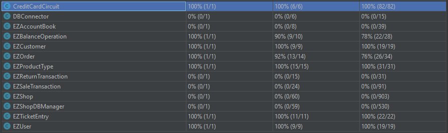

# Unit Testing Documentation

Authors:

- S281564 Marco Manco
- S290136 Giovanni Pollo
- S292477 Matteo Quarta
- S292602 Davide Fersino

Date: 19/05/2021

Version: 1.1

# Contents

- [Black Box Unit Tests](#black-box-unit-tests)

- [White Box Unit Tests](#white-box-unit-tests)

# Black Box Unit Tests

### **Class EZTicketEntry - method setBarCode**

**Criteria for method setBarCode:**

- barCode

**Predicates for method setBarCode:**

| Criteria      | Predicate              |
| ------------- | ---------------------- |
| _**barCode**_ | _**arbitrary values**_ |

**Boundaries**:

| Criteria | Boundary values |
| -------- | --------------- |
|          |                 |

_**No boundaries**_

**Combination of predicates**:

| barCode         | Valid / Invalid | Description of the test case                                        | JUnit test case                |
| --------------- | --------------- | ------------------------------------------------------------------- | ------------------------------ |
| _**any value**_ | valid           | setBarCode("9999999999999") -> getBarCode().equals("9999999999999") | TestEZTicketEntry.setBarCode() |

### **Class EZTicketEntry - method getAmount**

**Criteria for method getAmount:**

- amount

**Predicates for method getAmount:**

| Criteria     | Predicate              |
| ------------ | ---------------------- |
| _**amount**_ | _**arbitrary values**_ |

**Boundaries**:

| Criteria | Boundary values |
| -------- | --------------- |
|          |                 |

_**No boundaries**_

**Combination of predicates**:

| amount          | Valid / Invalid | Description of the test case       | JUnit test case               |
| --------------- | --------------- | ---------------------------------- | ----------------------------- |
| _**any value**_ | valid           | setAmount(10) -> getAmount() == 10 | TestEZTicketEntry.setAmount() |

### **Class EZTicketEntry - method setProductDescription**

**Criteria for method setProductDescription:**

- productDescription

**Predicates for method setProductDescription:**

| Criteria                 | Predicate              |
| ------------------------ | ---------------------- |
| _**productDescription**_ | _**arbitrary values**_ |

**Boundaries**:

| Criteria | Boundary values |
| -------- | --------------- |
|          |                 |

_**No boundaries**_

**Combination of predicates**:

| productDescription | Valid / Invalid | Description of the test case                                                         | JUnit test case                           |
| ------------------ | --------------- | ------------------------------------------------------------------------------------ | ----------------------------------------- |
| _**any value**_    | valid           | setProductDescription("Test descrizione") -> getBarCode().equals("Test descrizione") | TestEZTicketEntry.setProductDescription() |

### **Class EZTicketEntry - method setPricePerUnit**

**Criteria for method setPricePerUnit:**

- pricePerUnit

**Predicates for method setPricePerUnit:**

| Criteria           | Predicate              |
| ------------------ | ---------------------- |
| _**pricePerUnit**_ | _**arbitrary values**_ |

**Boundaries**:

| Criteria | Boundary values |
| -------- | --------------- |

_**No boundaries**_

**Combination of predicates**:

| pricePerUnit | Valid / Invalid | Description of the test case | JUnit test case |
| ---------- | --------------- | ---------------------------- | --------------- |
| _**any value**_ | valid | setPricePerUnit(10.25) -> getPricePerUnit() == 10.25|TestEZTicketEntry.setPricePerUnit()|

### **Class EZTicketEntry - method setDiscountRate**

**Criteria for method setDiscountRate:**

- discountRate

**Predicates for method setDiscountRate:**

| Criteria           | Predicate              |
| ------------------ | ---------------------- |
| _**pricePerUnit**_ | _**arbitrary values**_ |

**Boundaries**:

| Criteria | Boundary values |
| -------- | --------------- |

_**No boundaries**_

**Combination of predicates**:

| discountRate | Valid / Invalid | Description of the test case | JUnit test case |
| ---------- | --------------- | ---------------------------- | --------------- |
| _**any value**_ | valid | setDiscountRate(10.25) -> getDiscountRate() == 10.25|TestEZTicketEntry.setDiscountRate()|

### **Class EZOrder - method setBalanceID**

**Criteria**

- None

**Predicates**

- None

**Boundaries**

- None

**Combination of Predicates**

- None

| None | Valid / Invalid |            Description            | Example [ Id -> Id ] | JUnit test case  |
| :--: | :-------------: | :-------------------------------: | :------------------: | :--------------: |
|  \*  |   \*Valid\*\*   | Sets balanceID equal to parameter |     T1(42) -> 42     | testSetBalanceId |

### **Class EZOrder - method setProductCode**

**Criteria**

- None

**Predicates**

- None

**Boundaries**

- None

**Combination of Predicates**

- None

| None | Valid / Invalid |             Description             | Example [ String -> String ] |  JUnit test case   |
| :--: | :-------------: | :---------------------------------: | :--------------------------: | :----------------: |
|  \*  |   \*Valid\*\*   | Sets productCode equal to parameter |      T1("Any") -> "Any"      | testSetProductCode |

### **Class EZOrder - method setPricePerUnit**

**Criteria**

- None

**Predicates**

- None

**Boundaries**

- None

**Combination of Predicates**

- None

| None | Valid / Invalid |             Description              | Example [ Double -> Double ] |   JUnit test case   |
| :--: | :-------------: | :----------------------------------: | :--------------------------: | :-----------------: |
|  \*  |   \*Valid\*\*   | Sets pricePerUnit equal to parameter |     T1(420.69) -> 420.69     | testSetPricePerUnit |

### **Class EZOrder - method setQuantity**

**Criteria**

- None

**Predicates**

- None

**Boundaries**

- None

**Combination of Predicates**

- None

| None | Valid / Invalid |           Description            | Example [ int -> int ] | JUnit test case |
| :--: | :-------------: | :------------------------------: | :--------------------: | :-------------: |
|  \*  |   \*Valid\*\*   | Sets quantity equal to parameter |      T1(20) -> 20      | testSetQuantity |

### **Class EZOrder - method setStatus**

**Criteria**

- None

**Predicates**

- None

**Boundaries**

- None

**Combination of Predicates**

- None

| None | Valid / Invalid |          Description           | Example [ String -> String ] | JUnit test case |
| :--: | :-------------: | :----------------------------: | :--------------------------: | :-------------: |
|  \*  |   \*Valid\*\*   | Sets status equal to parameter |      T1("Any") -> "Any"      |  testSetStatus  |

### **Class EZOrder - method setOrderId**

**Criteria**

- None

**Predicates**

- None

**Boundaries**

- None

**Combination of Predicates**

- None

| None | Valid / Invalid |           Description           | Example [ Integer -> Integer ] | JUnit test case |
| :--: | :-------------: | :-----------------------------: | :----------------------------: | :-------------: |
|  \*  |   \*Valid\*\*   | Sets orderId equal to parameter |          T1(20) -> 20          | testSetOrderID  |

### **Class EZBalanceOperation - method setBalanceID**

**Criteria**

- None

**Predicates**

- None

**Boundaries**

- None

**Combination of Predicates**

- None

| None | Valid / Invalid |            Description            | Example [ Id -> Id] | JUnit test case  |
| :--: | :-------------: | :-------------------------------: | :-----------------: | :--------------: |
|  \*  |   \*Valid\*\*   | Sets balanceID equal to parameter |    T1(42) -> 42     | testSetBalanceId |

### **Class EZBalanceOperation - method setDate**

**Criteria**

- None

**Predicates**

- None

**Boundaries**

- None

**Combination of Predicates**

- None

| None | Valid / Invalid |         Description          | Example (Date -> Date) | JUnit test case |
| :--: | :-------------: | :--------------------------: | :--------------------: | :-------------: |
|  \*  |   \*Valid\*\*   | Sets date equal to parameter |  T1(Date d) -> Date d  |   testSetDate   |

### **Class EZBalanceOperation - method setMoney**

**Criteria**

- Sign of Money

**Predicates**
| Crietrion | Predicate |
| :-----------: | :-------: |
| Sign of Money | [-inf, 0) |
| | [0, inf] |

**Boundaries**
| Crietrion | Predicate |
| :-----------: | :-------: |
| Sign of Money | [-inf, 0) |
| | \[0\] |
| | (0, inf] |

**Combination of Predicates**

- None

| Sign of Money | Valid / Invalid |                       Description                       |   Example [ Money -> (Money, Type)]    | JUnit test case |
| :-----------: | :-------------: | :-----------------------------------------------------: | :------------------------------------: | :-------------: |
|   [-inf, 0)   |   \*Valid\*\*   |   Sets money equal to parameter and type to "CREDIT"    | T1b(200) -> (200, CREDIT) testSetMoney |
|     \[0\]     |   \*Valid\*\*   |   Sets money equal to parameter and type to "CREDIT"    |   T2b(0) -> (0, CREDIT) testSetMoney   |
|   (0, inf]    |   \*Valid\*\*   | Sets money equal to parameter \* -1 and type to "DEBIT" | T3b(-200) -> (200, DEBIT) testSetMoney |

### **Class EZBalanceOperation - method setType**

**Criteria**

- None

**Predicates**

- None

**Boundaries**

- None

**Combination of Predicates**

- None

| None | Valid / Invalid |         Description         | Example (String -> String) | JUnit test case |
| :--: | :-------------: | :-------------------------: | :------------------------: | :-------------: |
|  \*  |   \*Valid\*\*   | Sets typeequal to parameter |    T1("Test") -> "Test"    |   testSetType   |

### **Class EZUser - method setId**

**Criteria**

- Sign of Id

**Predicates**

| Crietrion  | Predicate |
| :--------: | :-------: |
| Sign of Id | [-inf, 0] |
|            | (0, inf]  |

**Boundaries**

| Crietrion  |  Predicate   |
| :--------: | :----------: |
| Sign of Id | -inf, 0, inf |
|            |              |

**Combination of Predicates**

- None

| None | Valid / Invalid |              Description              | Example [ Id -> Id] | JUnit test case |
| :--: | :-------------: | :-----------------------------------: | :-----------------: | :-------------: |
|  \*  |    **Valid**    | Sets userID equal to parameter passed |     T1(1) -> 1      |      setId      |
|  \*  |     Invalid     | Sets userID equal to parameter passed | T2(0) -> old_value  |      setId      |
|  \*  |     Invalid     | Sets userID equal to parameter passed | T3(-1) -> old_value |      setId      |

**Criteria**

- None

**Predicates**

- None

**Boundaries**

- None

**Combination of Predicates**

- None

| None | Valid / Invalid |           Description            | Example [ Username -> Username ] | JUnit test case |
| :--: | :-------------: | :------------------------------: | :------------------------------: | :-------------: |
|  \*  |    **Valid**    | Sets username equal to parameter |    T4("Giovanni") -> Giovanni    |   setUsername   |

### **Class EZUser - method setPassword**

**Criteria**

- None

**Predicates**

- None

**Boundaries**

- None

**Combination of Predicates**

- None

| None | Valid / Invalid |           Description            | Example [ Password -> Password ] | JUnit test case |
| :--: | :-------------: | :------------------------------: | :------------------------------: | :-------------: |
|  \*  |    **Valid**    | Sets password equal to parameter |       T5("12345") -> 12345       |   setPassword   |

### **Class EZUser - method setRole**

**Criteria**

- None

**Predicates**

- None

**Boundaries**

- None

**Combination of Predicates**

- None

| None | Valid / Invalid |         Description          | Example [ Role -> Role]  | JUnit test case |
| :--: | :-------------: | :--------------------------: | :----------------------: | :-------------: |
|  \*  |    **Valid**    | Sets role equal to parameter | T6("Cashier") -> Cashier |     setRole     |

### **Class EZProductType - method setQuantity**

**Criteria**

- None

**Predicates**

- None

**Boundaries**

- None

**Combination of Predicates**

- None

| None | Valid / Invalid |        Description         | Example [ Quantity -> Quantity ] | JUnit test case |
| :--: | :-------------: | :------------------------: | :------------------------------: | :-------------: |
|  \*  |    **Valid**    | Sets quantity to parameter |           T1(10) -> 10           |   setQuantity   |

### **Class EZProductType - method setLocation**

**Criteria**

- None

**Predicates**

- None

**Boundaries**

- None

**Combination of Predicates**

- None

| None | Valid / Invalid |        Description         | Example [ Location -> Location ] | JUnit test case |
| :--: | :-------------: | :------------------------: | :------------------------------: | :-------------: |
|  \*  |    **Valid**    | Sets location to parameter |       T1("1-a-1") -> 1-a-1       |   setLocation   |

### **Class EZProductType - method setNote**

**Criteria**

- None

**Predicates**

- None

**Boundaries**

- None

**Combination of Predicates**

- None

| None | Valid / Invalid |      Description       | Example [ Note -> Note] | JUnit test case |
| :--: | :-------------: | :--------------------: | :---------------------: | :-------------: |
|  \*  |    **Valid**    | Sets note to parameter | T1("Prova") -> "Prova"  |     setNote     |

### **Class EZProductType - method setProductDescription**

**Criteria**

- None

**Predicates**

- None

**Boundaries**

- None

**Combination of Predicates**

- None

| None | Valid / Invalid |          Description          |    Example [ Description -> Description ]    |    JUnit test case    |
| :--: | :-------------: | :---------------------------: | :------------------------------------------: | :-------------------: |
|  \*  |    **Valid**    | Sets description to parameter | T1("Prova descrizione") -> Prova descrizione | setProductDescription |

### **Class EZProductType - method setBarCode**

**Criteria**

- None

**Predicates**

- None

**Boundaries**

- None

**Combination of Predicates**

- None

| None | Valid / Invalid |        Description        |    Example [ barCode -> barCode ]    | JUnit test case |
| :--: | :-------------: | :-----------------------: | :----------------------------------: | :-------------: |
|  \*  |    **Valid**    | Sets barCode to parameter | T1("9999999999999") -> 9999999999999 |   setBarCode    |

### **Class EZProductType - method setPricePerUnit**

**Criteria**

- None

**Predicates**

- None

**Boundaries**

- None

**Combination of Predicates**

- None

| None | Valid / Invalid |          Description           | Example [ PricePerUnit -> PricePerUnit ] | JUnit test case |
| :--: | :-------------: | :----------------------------: | :--------------------------------------: | :-------------: |
|  \*  |    **Valid**    | Sets pricePerUnit to parameter |            T1(10.25) -> 10.25            | setPricePerUnit |

### **Class EZProductType - method setId**

**Criteria**

- Sign of Id

**Predicates**

| Crietrion  | Predicate |
| :--------: | :-------: |
| Sign of Id | [-inf, 0] |
|            | (0, inf]  |

**Boundaries**

| Crietrion  |  Predicate   |
| :--------: | :----------: |
| Sign of Id | -inf, 0, inf |
|            |              |

**Combination of Predicates**

- None

| None | Valid / Invalid |               Description                | Example [ Id -> Id]  | JUnit test case |
| :--: | :-------------: | :--------------------------------------: | :------------------: | :-------------: |
|  \*  |    **Valid**    | Sets productID equal to parameter passed |     T7(22) -> 22     |      SetId      |
|  \*  |   **Invalid**   | Sets productID equal to parameter passed |  T8(0) -> old_value  |      SetId      |
|  \*  |   **Invalid**   | Sets productID equal to parameter passed | T9(-22) -> old_value |      SetId      |

### **Class EZCustomer - method setCustomerName**

**Criteria**

- None

**Predicates**

- None

**Boundaries**

- None

**Combination of Predicates**

- None

| None | Valid / Invalid |         Description          |     Example [ Name -> Name ]     |    JUnit test case     |
| :--: | :-------------: | :--------------------------: | :------------------------------: | :--------------------: |
|  \*  |    **Valid**    | Sets name equal to parameter | T1("Mario Rossi") -> Mario Rossi | TestCustomerNameSetter |

### **Class EZCustomer - method setCustomerCard**

**Criteria**

- None

**Predicates**

- None

**Boundaries**

- None

**Combination of Predicates**

- None

| None | Valid / Invalid |              Description              |    Example [ Name -> Name ]    |    JUnit test case     |
| :--: | :-------------: | :-----------------------------------: | :----------------------------: | :--------------------: |
|  \*  |    **Valid**    | Sets customer card equal to parameter | T2("1234567890") -> 1234567890 | TestCustomerCardSetter |

### **Class EZCustomer - method setId**

**Criteria**

- Sign of Id

**Predicates**

| Crietrion  | Predicate |
| :--------: | :-------: |
| Sign of Id | [-inf, 0] |
|            | (0, inf]  |

**Boundaries**

| Crietrion  |  Predicate   |
| :--------: | :----------: |
| Sign of Id | -inf, 0, inf |
|            |              |

**Combination of Predicates**

- None

| None | Valid / Invalid |                Description                | Example [ Id -> Id]  | JUnit test case |
| :--: | :-------------: | :---------------------------------------: | :------------------: | :-------------: |
|  \*  |    **Valid**    | Sets CustomerID equal to parameter passed |     T3(42) -> 42     |    testSetId    |
|  \*  |   **Invalid**   | Sets CustomerID equal to parameter passed |  T4(0) -> old_value  |    testSetId    |
|  \*  |   **Invalid**   | Sets CustomerID equal to parameter passed | T5(-42) -> old_value |    testSetId    |

### **Class EZCustomer - method setPoints**

**Criteria**

- None

**Predicates**

- None

**Boundaries**

- None

**Combination of Predicates**

- None

| None | Valid / Invalid |              Description              | Example [ Name -> Name ] | JUnit test case |
| :--: | :-------------: | :-----------------------------------: | :----------------------: | :-------------: |
|  \*  |    **Valid**    | Sets customer card equal to parameter |       T2(42) -> 42       |  TestSetPoints  |

### **Class *CreditCardCircuit* - method *isCardPresent***

**Criteria for method *isCardPresent*:**

 - File contains cardNumber

   

**Predicates for method *isCardPresent*:**

| Criteria                 | Predicate |
| ------------------------ | --------- |
| File contains cardNumber | True      |
|                          | False     |

**Boundaries**:

| Criteria                 | Boundary values |
| ------------------------ | --------------- |
| File contains cardNumber | true, false     |

**Combination of predicates**:

| File contains cardNumber | Valid / Invalid | Description of the test case | JUnit test case |
|-------|-------|-------|-------|
| True             | Valid     | T1("4992739871645621"; True);  |testCardPresentInFile|
| False           | Invalid         | T2("1992739871645621"; False); | testCardNotPresentInFile                |

 ### **Class *CreditCardCircuit* - method *hasEnoughBalance***

**Criteria for method *hasEnoughBalance*:**

 - Sign of minBalance

 - File contains cardNumber

 - cardBalance

   

**Predicates for method *hasEnoughBalance*:**

| Criteria                 | Predicate     |
| ------------------------ | ------------- |
| Sign of minBalance       | >= 0          |
|                          | < 0           |
| File contains cardNumber | True          |
|                          | False         |
| cardBalance              | >= minBalance |
|                          | < minBalance  |

**Boundaries**:

| Criteria                 | Boundary values |
| ------------------------ | --------------- |
| Sign of minBalance       | -inf, 0, +inf   |
| File contains cardNumber | true, false     |
| cardBalance              | -inf, 0, +inf   |

**Combination of predicates**:

| Sign of minBalance | File contains cardNumber | cardBalance | Valid / Invalid | Description of the test case | JUnit test case |
|-------|-------|-------|-------|-------|-------|
| < 0                | *                        | *             | Invalid         |T1("4992739871645621", -1; False);|testNegativeMinBalance|
| >= 0               | False                    |               | Invalid         | T2("1992739871645621", 5; False); |         testCardNotPresentDuringHasEnoughBalance        |
| >= 0               | True                     | < minBalance  | Invalid         |T3("4992739871645621", 100; False);|testCardBalanceInsufficientDuringHasEnoughBalance|
| >= 0               | True                     | >= minBalance | Valid           |T4("4992739871645621", 5; True);|testCardBalanceSufficientDuringHasEnoughBalance|

 ### **Class *CreditCardCircuit* - method *pay***

**Criteria for method *pay*:**

 - Sign of amount

 - File contains cardNumber

 - cardBalance

   

**Predicates for method *pay*:**

| Criteria                 | Predicate |
| ------------------------ | --------- |
| Sign of amount           | >= 0      |
|                          | < 0       |
| File contains cardNumber | True      |
|                          | False     |
| cardBalance              | >= amount |
|                          | < amount  |

**Boundaries**:

| Criteria                 | Boundary values |
| ------------------------ | --------------- |
| Sign of amount           | -inf, 0, +inf   |
| File contains cardNumber | true, false     |
| cardBalance              | -inf, 0, +inf   |

**Combination of predicates**:

| Sign of amount | File contains cardNumber | cardBalance | Valid / Invalid | Description of the test case | JUnit test case |
|-------|-------|-------|-------|-------|-------|
| < 0                | *                        | *             | Invalid         |T1("4992739871645621", -1; False);|testNegativePayAmount|
| >= 0               | False                    |               | Invalid         | T2("1992739871645621", 5; False); |    testCardNotPresentDuringPay             |
| >= 0               | True                     | < amount | Invalid         |T3("4992739871645621", 100; False);|testCardBalanceInsufficientDuringPay|
| >= 0               | True                     | >= amount | Valid           |T4("4992739871645621", 5; True);|testCardBalanceSufficientDuringPay|

 ### **Class *CreditCardCircuit* - method *refund***

**Criteria for method *refund*:**

 - Sign of amount

 - File contains cardNumber

   

**Predicates for method *refund*:**

| Criteria                 | Predicate |
| ------------------------ | --------- |
| Sign of amount           | >= 0      |
|                          | < 0       |
| File contains cardNumber | True      |
|                          | False     |

**Boundaries**:

| Criteria                 | Boundary values |
| ------------------------ | --------------- |
| Sign of amount           | -inf, 0, +inf   |
| File contains cardNumber | true, false     |

**Combination of predicates**:

| Sign of amount | File contains cardNumber | Valid / Invalid | Description of the test case | JUnit test case |
|-------|-------|-------|-------|-------|
| < 0                | *                        | Invalid         |T1("4992739871645621", -10; False);|testNegativeRefundAmount|
| >= 0               | False                    | Invalid         | T2("1992739871645621", 10; False); |       testCardNotPresentDuringRefund          |
| >= 0               | True                     | Valid           |T3("4992739871645621", 5; True);|testRefundSuccess|

# White Box Unit Tests

### Test cases definition

| Unit name | JUnit test case |
| --------- | --------------- |
| EZBalanceOperation | TestEZBalanceOperation |
| EZCustomer | TestEZCustomer |
| EZOrder | TestEZOrder |
| EZProductType | TestEZProductType |
| EZTicketEntry | TestEZTicketEntry |
| EZUser | TestEZUser |
| CreditCardCircuit | TestCreditCardCircuit |

### Code coverage report

