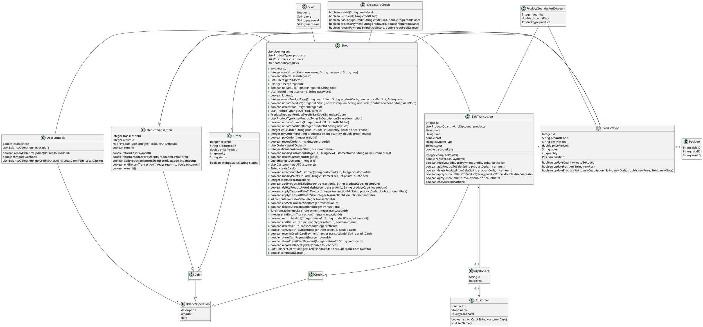

```plantuml
PLANTUML_LIMIT_SIZE=2000
@startuml
class AccountBook {
    double totalBalance
    List<BalanceOperation> operations

    boolean recordBalanceUpdate(double toBeAdded)
    double computeBalance()
    List<BalanceOperation> getCreditsAndDebits(LocalDate from, LocalDate to)

}

class CreditCardCircuit {

    boolean isValid(String creditCard)
    boolean isExpired(String creditCard)
    boolean hasEnoughCredit(String creditCard, double requiredBalance)
    boolean processPayment(String creditCard, double requiredBalance)
    boolean returnPayment(String creditCard, double requiredBalance)

}

class Credit {

}

class Customer {
    Integer id
    String name
    LoyaltyCard card

    boolean attachCard(String customerCard)
    void setName()

}

class Debit {

}

class BalanceOperation {
    description
    amount
    date
}

class LoyaltyCard {
    String id
    int points
    
}

class Order {
    Integer orderId
    String productCode
    double pricePerUnit
    int quantity
    String status

    boolean changeStatus(String status)

}

class ProductType{
    Integer id
    String productCode
    String description
    double pricePerUnit
    String note
    int quantity
    Position position

    boolean updateQuantity(int toBeAdded) 
    boolean updatePosition(String newPos) 
    boolean updateProduct(String newDescription, String newCode, double newPrice, String newNote)

}


class Position {
    String aisleID
    String rackID
    String levelID
}

class ReturnTransaction {
    Integer transactionId
    Integer returnId 
    Map<ProductType, Integer> productAndAmount
    boolean commit
    

    double returnCashPayment()
    double returnCreditCardPayment(CreditCardCircuit circuit)
    boolean addProductToReturn(String productCode, int amount)
    boolean endReturnTransaction(Integer returnId, boolean commit)
    boolean commit()

}

class ProductQuantityAndDiscount {
    Integer quantity
    double discountRate
    ProductType product

}

class SaleTransaction {
    Integer id 
    List<ProductQuantityAndDiscount> products
    String date
    String time
    double cost
    String paymentType
    String status
    double discountRate
    

    Integer computePoints()
    double receiveCashPayment()
    boolean receiveCreditCardPayment(CreditCardCircuit circuit)
    boolean addProductToSale(String productCode, int amount)
    boolean deleteProductFromSale(String productCode, int amount)
    boolean applyDiscountRateToProduct(String productCode, double discountRate)
    boolean applyDiscountRateToSale(double discountRate)
    boolean endSaleTransaction()

}

class Shop {
    List<User> users
    List<ProductType> products
    List<Customer> customers
    User authenticatedUser
    + void reset();
    + Integer createUser(String username, String password, String role) 
    + boolean deleteUser(Integer id) 
    + List<User> getAllUsers() 
    + User getUser(Integer id) 
    + boolean updateUserRights(Integer id, String role) 
    + User login(String username, String password) 
    + boolean logout();
    + Integer createProductType(String description, String productCode, double pricePerUnit, String note)
    + boolean updateProduct(Integer id, String newDescription, String newCode, double newPrice, String newNote)
    + boolean deleteProductType(Integer id) 
    + List<ProductType> getAllProductTypes() 
    + ProductType getProductTypeByBarCode(String barCode) 
    + List<ProductType> getProductTypesByDescription(String description) 
    + boolean updateQuantity(Integer productId, int toBeAdded) 
    + boolean updatePosition(Integer productId, String newPos) 
    + Integer issueOrder(String productCode, int quantity, double pricePerUnit)
    + Integer payOrderFor(String productCode, int quantity, double pricePerUnit)
    + boolean payOrder(Integer orderId) 
    + boolean recordOrderArrival(Integer orderId) 
    + List<Order> getAllOrders() 
    + Integer defineCustomer(String customerName) 
    + boolean modifyCustomer(Integer id, String newCustomerName, String newCustomerCard)
    + boolean deleteCustomer(Integer id) 
    + Customer getCustomer(Integer id) 
    + List<Customer> getAllCustomers() 
    + String createCard()
    + boolean attachCardToCustomer(String customerCard, Integer customerId)
    + boolean modifyPointsOnCard(String customerCard, int pointsToBeAdded)
    + Integer startSaleTransaction()
    + boolean addProductToSale(Integer transactionId, String productCode, int amount)
    + boolean deleteProductFromSale(Integer transactionId, String productCode, int amount)
    + boolean applyDiscountRateToProduct(Integer transactionId, String productCode, double discountRate)
    + boolean applyDiscountRateToSale(Integer transactionId, double discountRate)
    + int computePointsForSale(Integer transactionId)
    + boolean endSaleTransaction(Integer transactionId)
    + boolean deleteSaleTransaction(Integer transactionId)
    + SaleTransaction getSaleTransaction(Integer transactionId)
    + Integer startReturnTransaction(Integer transactionId)
    + boolean returnProduct(Integer returnId, String productCode, int amount)
    + boolean endReturnTransaction(Integer returnId, boolean commit)
    + boolean deleteReturnTransaction(Integer returnId)
    + double receiveCashPayment(Integer transactionId, double cash)
    + boolean receiveCreditCardPayment(Integer transactionId, String creditCard)
    + double returnCashPayment(Integer returnId)
    + double returnCreditCardPayment(Integer returnId, String creditCard)
    + boolean recordBalanceUpdate(double toBeAdded)
    + List<BalanceOperation> getCreditsAndDebits(LocalDate from, LocalDate to)
    + double computeBalance()
}

class User {
    Integer id
    String role
    String password
    String username

}

AccountBook - Shop
AccountBook -- "*" BalanceOperation

User -- Shop

CreditCardCircuit -- Shop

Credit --|> BalanceOperation

Debit --|> BalanceOperation

Order --|> Debit
Order "*" - ProductType

Shop - "*" ProductType
SaleTransaction - "*" ProductType

LoyaltyCard "0..1" --> Customer

SaleTransaction "*" -- "0..1" LoyaltyCard

ProductType - "0..1" Position

ReturnTransaction "*" - SaleTransaction
ReturnTransaction "*" - ProductType

ProductQuantityAndDiscount -- SaleTransaction
ProductQuantityAndDiscount -- ProductType

SaleTransaction --|> Credit
ReturnTransaction --|> Debit

@enduml
```

