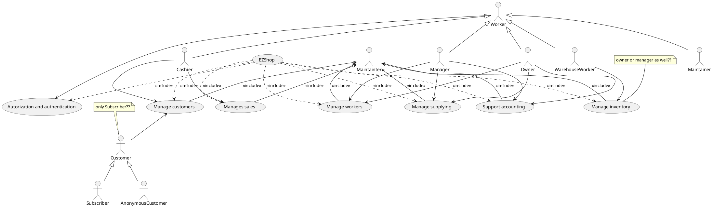

# High level Use case

### Use case 1, UC1 - Create fidelity card
| Actors Involved        | Cashier, Customer |
| ------------- |:-------------:|
|  Precondition     | Customer has not a fidelity card, Cashier can create a new fidelity card and is logged in |
|  Post condition     | Customer has a fidelity card |
|  Nominal Scenario     | Creation |
|  Variants     |  |

| Scenario 1.1 | |
| ------------- |:-------------:|
|  Precondition     | Customer has not a fidelity card, Cashier can create a new fidelity card and is logged in |
|  Post condition     | Customer has a fidelity card |
| Step#        | Description  |
|  1     | The customer has not a fidelity card |
|  2     | The cashier is asked to create the fidelity card |
| 3 | The customer fill the form |
| 4 | The cashier adds the new customer in the system |
| 5 | The customer has a fidelity card |

### Use case 2, UC2 - Delete fidelity card
| Actors Involved        | Cashier, Customer |
| ------------- |:-------------:|
|  Precondition     | Customer is owner of a fidelity card, Cashier can delete a fidelity card and is logged in |
|  Post condition     | Customer has not a fidelity card |
|  Nominal Scenario     | Deletion |
|  Variants     |  |

| Scenario 2.1 | |
| ------------- |:-------------:|
|  Precondition     |  Customer is owner of a fidelity card, Cashier can delete a fidelity card and is logged in |
|  Post condition     | Customer has not a fidelity card |
| Step#        | Description  |
|  1     | The customer want to delete her fidelity card |
|  2     | The cashier is asked to delete the fidelity card |
| 4 | The cashier delete the customer in the system |
| 5 | The customer has not a fidelity card and her data was deleted |

### Use case 3, UC3 - Search and modify customer details
| Actors Involved        | Cashier, Customer |
| ------------- |:-------------:|
|  Precondition     | Customer has already a fidelity card and her data is in the system, Cashier can modify a fidelity card data and is logged in |
|  Post condition     | Customer's data is updated |
|  Nominal Scenario     | Modification |
|  Variants     | Delete a customer, cannot find the customers to modify |

| Scenario 3.1 | |
| ------------- |:-------------:|
|  Precondition     | Customer has already a fidelity card and her data is in the system, Cashier can modify a fidelity card data and is logged in |
|  Post condition     | Customer's data is updated |
| Step#        | Description  |
| 1 | Some personal data of the customer need to be modified |
| 2 | The cashier is asked to modify the fidelity card data of the customer |
| 3 | The cashier searches the customer in the system |
| 4 | The customer tells the new personal data that need to be modified |
| 5 | The cashier modifies the customer's data in the system |
| 6 | The customer's data are updated |

| Scenario 3.2 | |
| ------------- |:-------------:|
|  Precondition     | Customer has already a fidelity card and her data is in the system, Cashier can modify a fidelity card data and is logged in |
|  Post condition     | Customer's data is updated |
| Step#        | Description  |
|  1     | Some personal data of the customer need to be modified |
|  2     | The cashier is asked to modity the fidelity card data of the customer |
| 3 | The cashier searches the customer in the system |
| 4 | The customer tells the new personal data that need to be modified |
| 5 | The cashier makes a mistake and delete the customer's data in the system |
| 6 | The cashier adds the customer's data again in the system |
| 7 | The customer has a new fidelity card and her data are updated |

| Scenario 3.3 | |
| ------------- |:-------------:|
|  Precondition     | Customer has already a fidelity card and her data is in the system, Cashier can modify a fidelity card data and is logged in |
|  Post condition     | Customer's data is updated |
| Step#        | Description  |
|  1     | Some personal data of the customer need to be modified |
|  2     | The cashier is asked to modity the fidelity card data of the customer |
| 3 | The cashier searches the customer in the system |
| 4 | The customer's data are not listed in the system |
| 5 | The cashier adds the customer's data again in the system with updated version |
| 6 | The customer has a new fidelity card and her data are updated |

### Use case 4, UC4 - Add a product

| Actors Involved        | Warehouse Worker |
| ------------- |:-------------:|
|  Precondition     | Warehouse Worker is logged in and can add a new product, the product is not in the system |
|  Post condition     | Product is in the system |
|  Nominal Scenario     | Creaction |
|  Variants     |  |

| Scenario 4.1 | |
| ------------- |:-------------:|
|  Precondition     | Warehouse Worker is logged in and can add a new product, the product is not in the system |
|  Post condition     | Product is in the system |
| Step#        | Description  |
| 1 | A new product must be added in the inventory |
| 2 | The Warehouse Worker fill the form with product data |
| 3 | The Warehouse Worker read the bar code of the product |
| 4 | The product is added |

### Use case 5, UC5 - delete a product
| Actors Involved        | Warehouse Worker |
| ------------- |:-------------:|
|  Precondition     | Warehouse Worker is logged in and can delete a product, the product is in the system |
|  Post condition     | Product is deleted |
|  Nominal Scenario     | Deletion |
|  Variants     | Unable to find the product |

| Scenario 5.1 | |
| ------------- |:-------------:|
|  Precondition     | Warehouse Worker is logged in and can delete products, the product is in the system |
|  Post condition     | Product is deleted |
| Step#        | Description  |
| 1 | A product must be deleted from the inventory |
| 2 | The warehouse worker searches the product |
| 3 | The product is deleted |

| Scenario 5.1   |                                                              |
| -------------- | :----------------------------------------------------------: |
| Precondition   | Warehouse Worker is logged in and can delete products, the product is in the system |
| Post condition |                The product is not in the list                |
| Step#          |                         Description                          |
| 1              |         A product must be deleted from the inventory         |
| 2              |          The warehouse worker searches the product           |
| 3              |                The product is not in the list                |

### Use case 6, UC6 - Modify a product

| Actors Involved        | Warehouse Worker |
| ------------- |:-------------:|
|  Precondition     | Warehouse Worker is logged in and can modify products, the product is in the system |
|  Post condition     | Product is updated |
|  Nominal Scenario     | Modification |
|  Variants     | Cannot find the product to modify |

| Scenario 6.1 | |
| ------------- |:-------------:|
|  Precondition     | Warehouse Worker is logged in and can modify products, the product is in the system |
|  Post condition     | Product is updated |
| Step#        | Description  |
| 1 | Some data of a product should be modifyed |
| 2 | The warehouse worker searches the product |
| 3 | Warehouse worker modifys the data |
| 4 | Product is updated |

| Scenario 6.2 | |
| ------------- |:-------------:|
|  Precondition     | Warehouse Worker is logged in and can modify products, the product is in the system |
|  Post condition     | Product is updated |
| Step#        | Description  |
| 1 | Some data of a product should be modifyed |
| 2 | The warehouse worker searches the product |
| 3 | Product is not in the list |
| 4 | Warehouse worker adds the product in the system with updated data |
| 5 | Product is updated |

### Use case 6, UC6 - List all product
| Actors Involved        | Warehouse Worker, Owner, Manager, Cashier |
| ------------- |:-------------:|
|  Precondition     | Worker is lodded in |
|  Post condition     | List of products is shown |
|  Nominal Scenario     | Showing |
|  Variants     | System bug with the result of no product shown |
